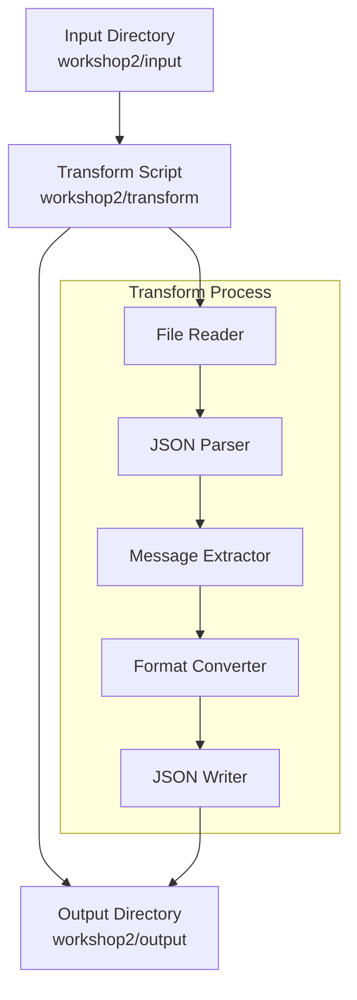

# Design Document: Workshop2 Transform Datasets

## Overview

The Dataset Transformer is a Python script that converts JSONL files from a messages-based format (with user/assistant roles) to a simple prompt-completion format required by SageMaker Studio. The system follows a clear separation of concerns with dedicated directories for input, transformation logic, and output.

The transformation extracts conversation pairs where the user message becomes the "prompt" and the assistant message becomes the "completion", maintaining data integrity while ensuring compatibility with SageMaker's fine-tuning requirements.

## Architecture



The architecture follows a pipeline pattern where each component has a single responsibility:
- **File Reader**: Handles input file discovery and reading
- **JSON Parser**: Parses JSONL records and validates structure
- **Message Extractor**: Extracts user and assistant messages from the messages array
- **Format Converter**: Creates the new prompt-completion structure
- **JSON Writer**: Outputs valid JSONL to the output directory

## Components and Interfaces

### DatasetTransformer Class
The main orchestrator that coordinates the transformation process.

```python
class DatasetTransformer:
    def __init__(self, input_dir: str, output_dir: str)
    def transform_file(self, input_file: str) -> TransformResult
    def transform_all_files(self) -> List[TransformResult]
    def _extract_messages(self, record: dict) -> Optional[Tuple[str, str]]
    def _create_prompt_completion(self, user_msg: str, assistant_msg: str) -> dict
```

### FileHandler Class
Manages file operations and directory structure.

```python
class FileHandler:
    def __init__(self, input_dir: str, output_dir: str)
    def get_input_files(self) -> List[str]
    def read_jsonl(self, file_path: str) -> Iterator[dict]
    def write_jsonl(self, file_path: str, records: Iterator[dict]) -> int
    def ensure_output_directory(self) -> None
```

### TransformResult Class
Encapsulates the results of a transformation operation.

```python
@dataclass
class TransformResult:
    input_file: str
    output_file: str
    records_processed: int
    records_transformed: int
    errors: List[str]
    success: bool
```

## Data Models

### Input Format (Messages-based)
```json
{
  "messages": [
    {
      "content": "What is 2+2?",
      "role": "user"
    },
    {
      "content": "2+2 equals 4.",
      "role": "assistant"
    }
  ]
}
```

### Output Format (Prompt-Completion)
```json
{
  "prompt": "What is 2+2?",
  "completion": "2+2 equals 4."
}
```

### Error Handling Strategy
- **Invalid JSON**: Log error, skip record, continue processing
- **Missing messages field**: Log warning, skip record
- **Incomplete conversation**: Log warning, skip record
- **File I/O errors**: Report error, continue with next file
- **Directory creation**: Create missing directories automatically

## Error Handling

The system implements graceful error handling at multiple levels:

1. **File Level**: If a file cannot be read, log the error and continue with remaining files
2. **Record Level**: If a record is malformed, skip it and continue processing the file
3. **Directory Level**: Automatically create output directories if they don't exist
4. **Validation Level**: Validate JSON structure before writing to ensure output integrity

All errors are collected in the TransformResult for comprehensive reporting.

## Testing Strategy

The testing approach combines unit tests for individual components and property-based tests for data transformation correctness:

### Unit Testing
- Test file reading and writing operations
- Test JSON parsing and validation
- Test error handling scenarios
- Test directory management

### Property-Based Testing
Property-based tests will validate universal correctness properties using the Hypothesis library for Python. Each test will run a minimum of 100 iterations to ensure comprehensive coverage across different input variations.

Tests will be tagged with: **Feature: workshop2-transform-datasets, Property {number}: {property_text}**

## Correctness Properties

*A property is a characteristic or behavior that should hold true across all valid executions of a system—essentially, a formal statement about what the system should do. Properties serve as the bridge between human-readable specifications and machine-verifiable correctness guarantees.*

### Property 1: Message extraction correctness
*For any* valid messages-based record with user and assistant messages, transforming the record should produce a prompt-completion object where the prompt equals the user message content and the completion equals the assistant message content.
**Validates: Requirements 1.1**

### Property 2: Content preservation
*For any* valid input record, the combined character content of the original user and assistant messages should be identical to the combined character content of the output prompt and completion fields, preserving Unicode characters and special formatting.
**Validates: Requirements 1.2, 4.4**

### Property 3: Valid JSON output structure
*For any* transformation result, every line in the output file should be valid JSON containing exactly "prompt" and "completion" fields with proper escaping of special characters.
**Validates: Requirements 1.3, 4.1, 4.2, 4.3**

### Property 4: File naming consistency
*For any* input file processed, the output file should have the same base name as the input file and be located in the output directory.
**Validates: Requirements 1.4**

### Property 5: Error resilience with valid record processing
*For any* file containing a mix of valid and invalid JSON records, the transformer should process all valid records while logging errors for invalid ones, and the count of transformed records should equal the count of valid input records.
**Validates: Requirements 2.1, 2.2, 2.3**

### Property 6: Batch processing independence
*For any* set of input files, processing them should produce the same number of output files, with each input file generating exactly one corresponding output file regardless of the processing order or the presence of other files.
**Validates: Requirements 3.1, 3.2**

### Property 7: Complete directory processing
*For any* input directory containing JSONL files, when no specific files are specified, the transformer should process every JSONL file in the directory.
**Validates: Requirements 3.3**

### Property 8: Batch error isolation
*For any* batch of files where some files have processing errors, the transformer should successfully process all valid files and produce output for them, with errors in one file not affecting the processing of other files.
**Validates: Requirements 3.4**