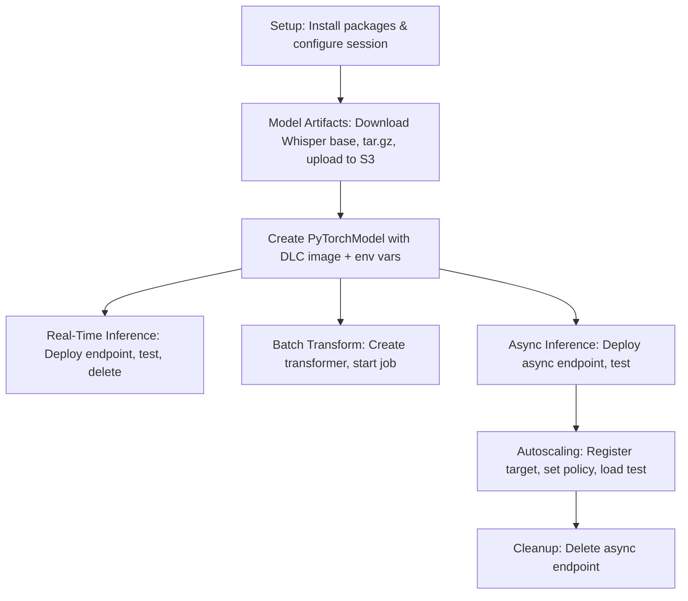

# Design Document

## Overview

This design upgrades the OpenAI Whisper SageMaker deployment notebook (`pytorch_sagemaker_4.ipynb`) from SageMaker Distribution 2.x to 4.x, while applying shared usability enhancements to both the upgraded notebook and the baseline (`pytorch_sagemaker_2.ipynb`). The upgrade maintains full functional parity with the original — same Whisper base model, same three deployment patterns (real-time, batch transform, async with autoscaling) — while updating all dependencies, DLC image references, and model serving configuration to current versions.

### Key Design Decisions

1. **DLC Image Selection**: Use `huggingface-pytorch-inference:2.6.0-transformers5.5.3-gpu-py312-cu124-ubuntu22.04` — the latest HuggingFace PyTorch inference GPU image available on SageMaker. There is no 2.5.x HuggingFace inference image (it jumps from 2.1 to 2.6), and PyTorch 2.6 is fully compatible with models saved from PyTorch 2.5.x environments.

2. **Model Serving Framework Change**: The 2.6.0 DLC uses TorchServe (not MMS). Environment variables must change from `MMS_*` to `TS_*` prefixes.

3. **Automatic Region Resolution**: Use `boto3.Session().region_name` to construct the DLC image URI programmatically, eliminating the `[REGION]` placeholder.

4. **Automatic Bucket Resolution**: Use `sagemaker.Session().default_bucket()` to eliminate the `[BUCKET NAME]` placeholder.

5. **Structural Parity**: Both notebooks share identical code logic; only the setup markdown, pip version specifiers, and DLC image tag differ.

## Architecture

The notebook architecture remains unchanged — it is a linear sequence of cells that:

1. Install dependencies and import packages
2. Download and package Whisper model artifacts
3. Upload model to S3
4. Create a `PyTorchModel` with the DLC image and environment config
5. Deploy via three patterns: real-time endpoint, batch transform, async endpoint with autoscaling
6. Clean up endpoints



### Differences Between Notebooks

| Aspect | `pytorch_sagemaker_2.ipynb` (Baseline) | `pytorch_sagemaker_4.ipynb` (Upgraded) |
|--------|---------------------------------------|---------------------------------------|
| Setup instruction | SageMaker Distribution 2.x / Data Science 2.0 | SageMaker Distribution 4.x |
| openai-whisper | 20230918 | 20231117 |
| torchaudio | 2.1.0 | 2.5.1 |
| datasets | 2.16.1 | 3.2.0 |
| sagemaker SDK | 2.184.0 | 2.232.1 |
| librosa | pinned (e.g., 0.10.1) | pinned (e.g., 0.10.2) |
| soundfile | pinned (e.g., 0.12.1) | pinned (e.g., 0.12.1) |
| DLC image tag | `2.0.0-transformers4.28.1-gpu-py310-cu118-ubuntu20.04` | `2.6.0-transformers5.5.3-gpu-py312-cu124-ubuntu22.04` |
| Serving env vars | `MMS_*` | `TS_*` |

### Shared Enhancements (Both Notebooks)

| Enhancement | Before | After |
|-------------|--------|-------|
| S3 bucket | `'[BUCKET NAME]'` | `sagemaker.Session().default_bucket()` |
| Region in DLC URI | `[REGION]` placeholder | `boto3.Session().region_name` |
| load_dataset call | Missing `'clean'` config arg | `load_dataset('MLCommons/peoples_speech', 'clean', split='train', streaming=True)` |

## Components and Interfaces

### Component 1: Setup Cell (Markdown)

**Purpose**: Instruct user on which SageMaker Studio image and instance to select.

- Baseline: "select the Data Science 2.0 image and choose the ml.m5.large instance"
- Upgraded: "select the SageMaker Distribution 4.x image and choose the ml.m5.large instance"

### Component 2: Package Installation Cell

**Purpose**: Install all required Python packages with pinned versions.

**Upgraded notebook packages**:
```python
%pip install openai-whisper==20231117 -q
%pip install torchaudio==2.5.1 -q
%pip install datasets==3.2.0 -q
%pip install sagemaker==2.232.1 -q
%pip install librosa==0.10.2 -q
%pip install soundfile==0.12.1 -q
```

**Baseline notebook packages** (unchanged except for pins on librosa/soundfile):
```python
%pip install openai-whisper==20230918 -q
%pip install torchaudio==2.1.0 -q
%pip install datasets==2.16.1 -q
%pip install sagemaker==2.184.0 -q
%pip install librosa==0.10.1 -q
%pip install soundfile==0.12.1 -q
```

### Component 3: Configuration Cell

**Purpose**: Set up SageMaker session, bucket, prefix, role, and boto3 clients.

```python
sess = sagemaker.session.Session()
bucket = sagemaker.Session().default_bucket()
prefix = 'whisper_blog_post'
role = sagemaker.get_execution_role()
sm_runtime = boto3.client("sagemaker-runtime")
```

### Component 4: DLC Image URI Cell

**Purpose**: Construct the inference container image URI with automatic region resolution.

```python
id = int(time.time())
model_name = f'whisper-pytorch-model-{id}'

# Resolve AWS region automatically for the DLC image URI
region = boto3.Session().region_name
image = f"763104351884.dkr.ecr.{region}.amazonaws.com/huggingface-pytorch-inference:2.6.0-transformers5.5.3-gpu-py312-cu124-ubuntu22.04"
```

For the baseline notebook, the image tag remains `2.0.0-transformers4.28.1-gpu-py310-cu118-ubuntu20.04` but uses the same automatic region resolution.

### Component 5: PyTorchModel Creation Cell

**Purpose**: Create the SageMaker PyTorchModel with serving environment variables.

**Upgraded notebook** (TorchServe):
```python
whisper_pytorch_model = PyTorchModel(
    model_data=model_uri,
    image_uri=image,
    role=role,
    entry_point="inference.py",
    source_dir='code',
    name=model_name,
    env={
        'TS_MAX_REQUEST_SIZE': '2000000000',
        'TS_MAX_RESPONSE_SIZE': '2000000000',
        'TS_DEFAULT_RESPONSE_TIMEOUT': '900'
    }
)
```

**Baseline notebook** (MMS — unchanged):
```python
whisper_pytorch_model = PyTorchModel(
    model_data=model_uri,
    image_uri=image,
    role=role,
    entry_point="inference.py",
    source_dir='code',
    name=model_name,
    env={
        'MMS_MAX_REQUEST_SIZE': '2000000000',
        'MMS_MAX_RESPONSE_SIZE': '2000000000',
        'MMS_DEFAULT_RESPONSE_TIMEOUT': '900'
    }
)
```

### Component 6: Real-Time Inference Cells

Unchanged logic between notebooks. Deploys to `ml.g4dn.xlarge` with audio serializer and JSON deserializer. Tests with `MLCommons/peoples_speech` dataset using the corrected `load_dataset` call.

### Component 7: Batch Transform Cells

Unchanged logic. Creates transformer with `max_payload=100`, runs in non-blocking mode.

### Component 8: Async Inference + Autoscaling Cells

Unchanged logic. Deploys async endpoint, configures Application Auto Scaling with min=0, max=3, target backlog=3.0, cooldown=60s.

### Component 9: Cleanup Cell

Unchanged logic. Deletes async endpoint.

## Data Models

This feature does not introduce new data models. The notebook operates on:

- **Whisper model artifact**: `base.pt` → packaged as `model.tar.gz` → stored at `s3://{bucket}/{prefix}/pytorch/model/model.tar.gz`
- **Audio input**: WAV files from `MLCommons/peoples_speech` dataset
- **Inference output**: JSON with `{"text": "transcription..."}` structure

## Error Handling

| Error Scenario | Handling |
|----------------|----------|
| Package version conflict on install | Pinned versions ensure reproducibility; kernel restart cell reminds user |
| DLC image not found in region | Automatic region resolution eliminates the most common misconfiguration; if image genuinely unavailable, SageMaker raises `ClientError` with clear message |
| S3 bucket access denied | `default_bucket()` uses the SageMaker-managed bucket tied to the execution role, minimizing permission issues |
| Endpoint deployment timeout | `%%time` magic shows elapsed time; 7-minute expectation documented in comment |
| Deprecated SDK API warnings | SDK version pinned to 2.232.1 where all used APIs are current and non-deprecated |
| `load_dataset` missing config error | Fixed by adding `'clean'` as second positional argument |

## Testing Strategy

### Why Property-Based Testing Does NOT Apply

This feature is a **notebook configuration upgrade** — it modifies version specifiers, image URIs, environment variable names, and hardcoded placeholders. There are no pure functions, parsers, serializers, or algorithmic logic being written. The notebooks are declarative infrastructure configuration and deployment orchestration scripts.

Appropriate testing strategies for this feature:

### Manual Integration Testing

1. **Baseline notebook (`pytorch_sagemaker_2.ipynb`)**: Execute all cells sequentially in SageMaker Studio with Distribution 2.x image on ml.m5.large. Verify:
   - All pip installs succeed without version conflicts
   - Import cell runs without errors
   - `bucket` resolves automatically (no `[BUCKET NAME]` placeholder)
   - DLC image URI contains resolved region (no `[REGION]` placeholder)
   - `load_dataset` call succeeds with `'clean'` argument
   - Real-time inference returns transcription text

2. **Upgraded notebook (`pytorch_sagemaker_4.ipynb`)**: Execute all cells sequentially in SageMaker Studio with Distribution 4.x image on ml.m5.large. Verify:
   - All pip installs succeed without version conflicts
   - Import cell runs without errors
   - No DeprecationWarnings in any cell output
   - `bucket` resolves automatically
   - DLC image URI uses resolved region and correct 2.6.0 tag
   - TorchServe env vars are set (not MMS)
   - Real-time inference returns transcription text
   - Batch transform job starts successfully
   - Async endpoint deploys and accepts requests
   - Autoscaling policy registers successfully

### Structural Validation (Diff-Based)

- Compare both notebooks cell-by-cell to confirm they differ ONLY in:
  - Setup markdown (Distribution version instruction)
  - `%pip install` version specifiers
  - DLC image tag
  - Environment variable prefix (`MMS_` vs `TS_`)
- All other cells must be byte-identical.

### Smoke Tests

- Verify no occurrences of `[BUCKET NAME]` in either notebook
- Verify no occurrences of `[REGION]` in either notebook
- Verify no occurrences of "Data Science 2.0" in the upgraded notebook
- Verify `'clean'` appears in the `load_dataset` call in both notebooks
