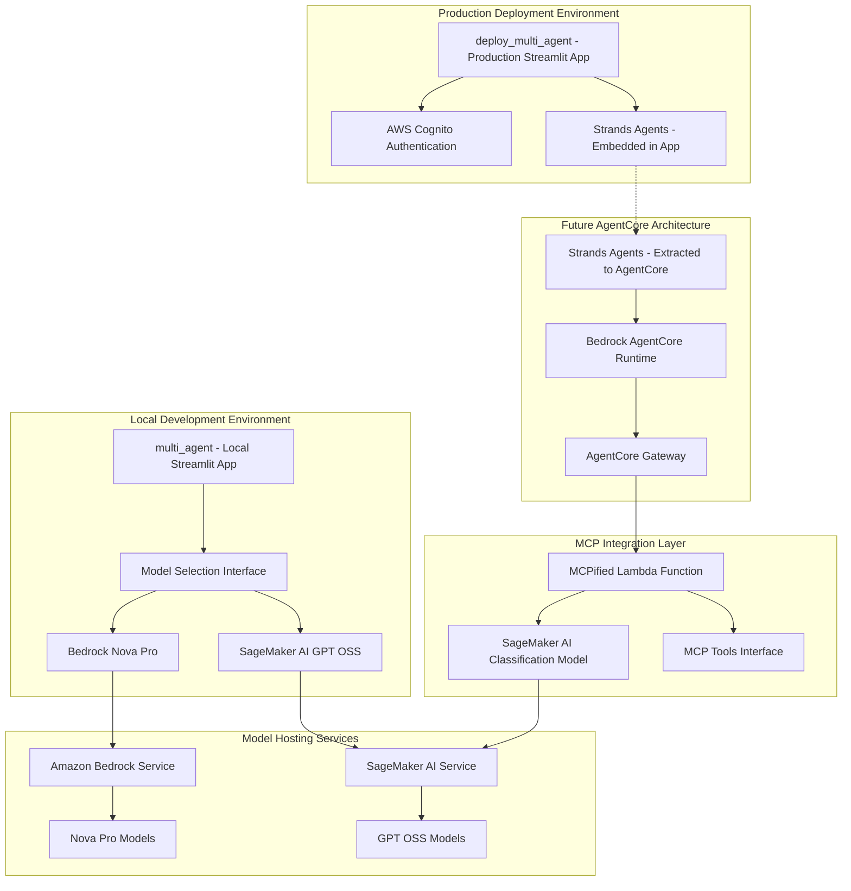

# Workshop 4 Architecture Simplification Design Document

## Overview

This design focuses on simplifying and refactoring the Workshop 4 multi-agent architecture to better illustrate deployment patterns and model choice capabilities. The refactoring involves renaming directories for generic naming, adding model choice between Bedrock and SageMaker AI, preparing for future Bedrock AgentCore integration, and adding MCP-enabled Lambda functions with classification models. The simplified architecture will demonstrate the contrast between local development (multi_agent) and production deployment (deploy_multi_agent) while showcasing different model hosting options and advanced agent tooling.

## Architecture

### High-Level Simplified Architecture



### Component Architecture

The simplified architecture follows a clear separation between development and production environments:

1. **Local Development (multi_agent)**: Streamlit app with model choice capabilities for development and testing
2. **Production Deployment (deploy_multi_agent)**: Streamlit app with Cognito authentication for secure production access
3. **Future AgentCore Integration**: Planned migration path for running Strands Agents on Bedrock AgentCore
4. **MCP Integration**: Advanced agent tooling with machine learning classification capabilities

## Components and Interfaces

### Local Development Environment (multi_agent)

**Multi-Agent Local Application**
- Renamed from "multi_agent_bedrock" to "multi_agent" for generic naming
- Streamlit-based local development environment without authentication requirements
- Integrated model selection interface for comparing different hosting options
- Maintains all existing multi-agent functionality with enhanced model choice

**Model Selection Interface**
- Dropdown selection between Bedrock Nova Pro and SageMaker AI GPT OSS models
- Dynamic model switching with real-time configuration updates
- Model performance comparison capabilities for educational purposes
- Clear status indicators showing active model and connection status

**Bedrock Integration (Local)**
- Maintains existing Bedrock Nova Pro integration patterns
- Uses existing AWS credentials and region configuration
- Preserves all current Bedrock model capabilities and tool integrations
- Provides baseline comparison for SageMaker AI integration

**SageMaker AI Integration (Local)**
- New integration with SageMaker AI endpoints for GPT OSS model access
- Endpoint configuration and management for GPT OSS models
- Standardized interface matching Bedrock integration patterns
- Error handling and fallback mechanisms for endpoint availability

### Production Deployment Environment (deploy_multi_agent)

**Deploy Multi-Agent Production Application**
- Renamed from "deploy_multi_agent_bedrock" to "deploy_multi_agent" for generic naming
- Production-ready Streamlit application with enterprise security features
- AWS Cognito authentication integration for secure user access
- Maintains all existing deployment infrastructure and capabilities

**AWS Cognito Authentication**
- User pool configuration for secure authentication
- Session management and token handling
- Integration with existing IAM roles and permissions
- Consistent access controls across web interface and future MCP integration

**Strands Agents (Embedded)**
- Current implementation maintains Strands Agents as part of the Streamlit application
- Modular design patterns to support future extraction to AgentCore
- Clear separation of agent logic from application infrastructure
- Documentation of planned AgentCore migration path

### Future AgentCore Integration

**Bedrock AgentCore Runtime**
- Planned migration target for Strands Agents extraction
- Enterprise-grade scalability, resilience, and observability
- Container-based deployment using Docker and ECR
- HTTP server endpoints for agent invocation and health checks

**AgentCore Gateway**
- Managed service for routing requests to AgentCore runtimes
- Integration point for MCP-enabled Lambda functions
- Authentication and authorization for agent access
- Multi-tenant support with built-in security protections

**Migration Architecture**
- Phased approach for extracting agents from Streamlit app to AgentCore
- Backward compatibility during migration process
- Clear interfaces for agent communication and coordination
- Monitoring and logging for migration validation

### MCP Integration Layer

**MCPified Lambda Function**
- AWS Lambda function implementing Model Context Protocol (MCP) interface
- Wrapper around SageMaker AI trained classification model
- Standardized tool interface for agent integration
- Serverless execution model for cost optimization

**SageMaker AI Classification Model**
- Pre-trained or custom-trained classification model hosted on SageMaker AI
- Real-time inference endpoint for classification tasks
- Integration with MCP Lambda for agent tool access
- Model versioning and deployment management

**MCP Tools Interface**
- Standardized tool discovery and invocation protocols
- Integration with Strands Agents tool system
- Error handling and response formatting for agent consumption
- Authentication and authorization for tool access

## Data Models

### Model Configuration

```typescript
interface ModelConfig {
  modelType: 'bedrock' | 'sagemaker';
  modelId: string;
  endpoint?: string;
  region: string;
  credentials: AWSCredentials;
  parameters: ModelParameters;
}

interface BedrockModelConfig extends ModelConfig {
  modelType: 'bedrock';
  modelId: 'us.amazon.nova-pro-v1:0';
  service: 'bedrock-runtime';
}

interface SageMakerModelConfig extends ModelConfig {
  modelType: 'sagemaker';
  modelId: string;
  endpoint: string;
  service: 'sagemaker-runtime';
}
```

### Agent Configuration

```typescript
interface AgentConfig {
  agentId: string;
  role: AgentRole;
  modelConfig: ModelConfig;
  tools: ToolConfig[];
  systemPrompt: string;
  capabilities: string[];
}

interface DeploymentConfig {
  environment: 'local' | 'production';
  authentication: AuthConfig;
  agentRuntime: 'embedded' | 'agentcore';
  mcpIntegration: MCPConfig;
}
```

### MCP Integration Models

```typescript
interface MCPToolConfig {
  toolName: string;
  lambdaFunction: string;
  description: string;
  inputSchema: JSONSchema;
  outputSchema: JSONSchema;
  authentication: MCPAuthConfig;
}

interface ClassificationRequest {
  input: string;
  modelEndpoint: string;
  parameters: ClassificationParameters;
}

interface ClassificationResponse {
  predictions: ClassificationResult[];
  confidence: number;
  metadata: ResponseMetadata;
}
```

## Correctness Properties

*A property is a characteristic or behavior that should hold true across all valid executions of a system-essentially, a formal statement about what the system should do. Properties serve as the bridge between human-readable specifications and machine-verifiable correctness guarantees.*

Now I need to use the prework tool to analyze the acceptance criteria before writing the correctness properties.
### Property Reflection

After analyzing all acceptance criteria, several properties can be consolidated to eliminate redundancy:

- Properties 1.3, 1.4, 1.5 all relate to maintaining consistency during renaming and can be consolidated into "Directory Rename Consistency"
- Properties 2.2, 2.3, 2.4 all relate to model integration functionality and can be consolidated into "Model Integration Functionality"
- Properties 3.2, 3.4, 3.5 all relate to modular design and maintaining functionality and can be consolidated into "AgentCore Preparation Architecture"
- Properties 4.1, 4.2, 4.3, 4.4 all relate to MCP integration working correctly and can be consolidated into "MCP Integration Functionality"
- Properties 5.2, 5.5 both relate to authentication working correctly and can be consolidated into "Authentication Integration"
- Properties 6.1, 6.2, 6.3, 6.4, 6.5 all relate to system modularity and can be consolidated into "System Modularity and Configuration"

### Core Properties

**Property 1: Directory Rename Consistency**
*For any* file or configuration in the system, after renaming directories from "deploy_multi_agent_bedrock" to "deploy_multi_agent" and "multi_agent_bedrock" to "multi_agent", all references should be updated correctly and functionality should be preserved
**Validates: Requirements 1.3, 1.4, 1.5**

**Property 2: Model Integration Functionality**
*For any* model selection (Bedrock Nova Pro or SageMaker AI GPT OSS), the system should integrate correctly, maintain existing functionality for Bedrock, and properly configure all agents to use the selected model
**Validates: Requirements 2.2, 2.3, 2.4**

**Property 3: AgentCore Preparation Architecture**
*For any* agent component in the system, the code should be structured with modular design patterns that support future AgentCore extraction while maintaining all current multi-agent capabilities
**Validates: Requirements 3.2, 3.4, 3.5**

**Property 4: MCP Integration Functionality**
*For any* MCP tool request, the MCPified Lambda function should correctly wrap the SageMaker AI classification model, integrate through AgentCore Gateway, provide accurate classification results, and enable agent access to classification capabilities
**Validates: Requirements 4.1, 4.2, 4.3, 4.4**

**Property 5: Authentication Integration**
*For any* access attempt to the production Deploy_Multi_Agent application, AWS Cognito authentication should be properly enforced with correct user management and session handling
**Validates: Requirements 5.2, 5.5**

**Property 6: System Modularity and Configuration**
*For any* system component (agents, models, tools, services), the system should support modular configuration, pluggable interfaces, independent deployment, standardized tool integration, and configuration-driven customization
**Validates: Requirements 6.1, 6.2, 6.3, 6.4, 6.5**

## Error Handling

### Directory Renaming and Reference Updates

**Broken Reference Detection**
- Scan all files for old directory references after renaming
- Implement automated reference validation and correction
- Provide rollback mechanisms for failed rename operations
- Maintain backup of original structure during transition

**Import and Configuration Errors**
- Handle broken imports due to directory structure changes
- Validate configuration files after updates
- Provide clear error messages for missing references
- Support incremental reference updates with validation

### Model Integration Errors

**Model Availability Issues**
- Handle Bedrock service outages with graceful degradation
- Implement fallback mechanisms for SageMaker AI endpoint failures
- Provide clear error messages for model selection issues
- Monitor model endpoint health and availability

**Model Switching Errors**
- Validate model configurations before switching
- Handle partial configuration updates with rollback
- Provide status indicators for model switching progress
- Implement retry mechanisms for failed model updates

**SageMaker AI Integration Errors**
- Handle endpoint deployment and scaling issues
- Implement proper error handling for inference requests
- Provide cost monitoring and optimization alerts
- Support model versioning and deployment rollback

### Authentication and Security Errors

**Cognito Integration Failures**
- Handle user pool configuration errors
- Implement proper session timeout and renewal
- Provide clear authentication error messages
- Support user registration and password reset flows

**Authorization Errors**
- Implement proper role-based access control
- Handle token validation and refresh failures
- Provide audit logging for security events
- Support multi-tenant access patterns

### MCP Integration Errors

**Lambda Function Errors**
- Handle classification model inference failures
- Implement proper error response formatting for MCP protocol
- Provide retry mechanisms for transient failures
- Monitor Lambda function performance and costs

**AgentCore Gateway Errors**
- Handle gateway routing and authentication failures
- Implement circuit breaker patterns for failing services
- Provide proper error propagation to agents
- Support load balancing and failover mechanisms

## Testing Strategy

### Dual Testing Approach

The testing strategy combines unit testing and property-based testing to ensure comprehensive coverage:

**Unit Testing**
- Test individual component functionality and integration points
- Validate specific directory renaming scenarios and edge cases
- Test model switching and configuration updates
- Verify authentication flows and error conditions

**Property-Based Testing**
- Use Hypothesis (Python) for property-based testing framework
- Configure each property-based test to run minimum 100 iterations
- Test universal properties across all system configurations
- Validate consistency and correctness with random inputs

**Property-Based Test Requirements**
- Each correctness property must be implemented by a single property-based test
- Tests must be tagged with format: '**Feature: workshop4-architecture-simplification, Property {number}: {property_text}**'
- Tests should generate random system configurations and validate properties hold
- Focus on consistency, integration correctness, and error handling

**Integration Testing**
- Test end-to-end workflows with real AWS services
- Validate cross-environment compatibility (local vs production)
- Test model switching with actual Bedrock and SageMaker AI endpoints
- Verify MCP integration with real classification models

**Migration Testing**
- Test directory renaming with various project structures
- Validate reference updates across different file types
- Test backward compatibility during transition periods
- Verify rollback procedures for failed migrations

## Common Issues and Solutions

**Directory Renaming Issues**
- Incomplete reference updates causing broken imports
- Case sensitivity issues on different operating systems
- Git history preservation during directory moves
- IDE and tooling configuration updates

**Model Integration Issues**
- Authentication and credential management across services
- Model endpoint configuration and networking
- Cost optimization and resource management
- Performance differences between Bedrock and SageMaker AI

**AgentCore Preparation Issues**
- Agent code coupling with Streamlit application
- State management and persistence patterns
- Communication protocols and message formats
- Monitoring and observability integration

**MCP Integration Issues**
- Protocol compliance and message formatting
- Authentication and authorization across services
- Error handling and retry mechanisms
- Performance optimization for real-time inference