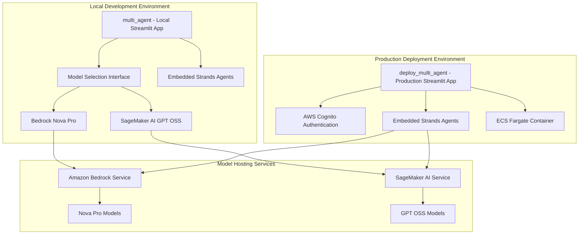

# Workshop 4 Architecture Simplification Design Document

## Overview

This design focuses on simplifying the Workshop 4 multi-agent architecture to support DATASCI 210 course objectives by maintaining a monolithic Streamlit application approach. The refactoring removes Bedrock AgentCore complexity and focuses on practical AI application development patterns. The simplified architecture demonstrates the contrast between local development (multi_agent) and production deployment (deploy_multi_agent) while showcasing different model hosting options within a single, manageable application deployment.

## Architecture

### High-Level Simplified Architecture



### Component Architecture

The simplified architecture follows a clear separation between development and production environments with embedded agent orchestration:

1. **Local Development (multi_agent)**: Streamlit app with model choice capabilities and embedded agents for development and testing
2. **Production Deployment (deploy_multi_agent)**: Streamlit app with Cognito authentication and embedded agents for secure production access
3. **Monolithic Design**: All agents run within the same application process for simplified deployment and management
4. **Model Integration**: Direct integration with Bedrock and SageMaker AI services without additional service layers

## Components and Interfaces

### Local Development Environment (multi_agent)

**Multi-Agent Local Application**
- Renamed from "multi_agent_bedrock" to "multi_agent" for generic naming
- Streamlit-based local development environment without authentication requirements
- Integrated model selection interface for comparing different hosting options
- Maintains all existing multi-agent functionality with enhanced model choice

**Model Selection Interface**
- Dropdown selection between Bedrock Nova Pro and SageMaker AI GPT OSS models
- Dynamic model switching with real-time configuration updates
- Model performance comparison capabilities for educational purposes
- Clear status indicators showing active model and connection status

**Bedrock Integration (Local)**
- Maintains existing Bedrock Nova Pro integration patterns
- Uses existing AWS credentials and region configuration
- Preserves all current Bedrock model capabilities and tool integrations
- Provides baseline comparison for SageMaker AI integration

**SageMaker AI Integration (Local)**
- New integration with SageMaker AI endpoints for GPT OSS model access
- Endpoint configuration and management for GPT OSS models
- Standardized interface matching Bedrock integration patterns
- Error handling and fallback mechanisms for endpoint availability

### Production Deployment Environment (deploy_multi_agent)

**Deploy Multi-Agent Production Application**
- Renamed from "deploy_multi_agent_bedrock" to "deploy_multi_agent" for generic naming
- Production-ready Streamlit application with enterprise security features
- AWS Cognito authentication integration for secure user access
- Maintains all existing deployment infrastructure and capabilities

**AWS Cognito Authentication**
- User pool configuration for secure authentication
- Session management and token handling
- Integration with existing IAM roles and permissions
- Consistent access controls across web interface

**ECS Fargate Deployment**
- Single container deployment with all agents embedded
- Auto-scaling based on application demand
- Simplified operational model with single service to monitor
- Cost-effective deployment without microservice overhead

**Embedded Strands Agents**
- All Strands Agents run within the Streamlit application process
- In-process communication between agents for optimal performance
- Simplified deployment model with single container/process
- Maintains all existing multi-agent functionality within monolithic architecture
- No external service dependencies for agent coordination

## Data Models

### Model Configuration

```typescript
interface ModelConfig {
  modelType: 'bedrock' | 'sagemaker';
  modelId: string;
  endpoint?: string;
  region: string;
  credentials: AWSCredentials;
  parameters: ModelParameters;
}

interface BedrockModelConfig extends ModelConfig {
  modelType: 'bedrock';
  modelId: 'us.amazon.nova-pro-v1:0';
  service: 'bedrock-runtime';
}

interface SageMakerModelConfig extends ModelConfig {
  modelType: 'sagemaker';
  modelId: string;
  endpoint: string;
  service: 'sagemaker-runtime';
}
```

### Agent Configuration

```typescript
interface AgentConfig {
  agentId: string;
  role: AgentRole;
  modelConfig: ModelConfig;
  tools: ToolConfig[];
  systemPrompt: string;
  capabilities: string[];
}

interface DeploymentConfig {
  environment: 'local' | 'production';
  authentication: AuthConfig;
  agentRuntime: 'embedded';
  containerConfig: ContainerConfig;
}
```
interface MCPToolConfig {
  toolName: string;
  lambdaFunction: string;
  description: string;
  inputSchema: JSONSchema;
  outputSchema: JSONSchema;
  authentication: MCPAuthConfig;
}

interface ClassificationRequest {
  input: string;
  modelEndpoint: string;
  parameters: ClassificationParameters;
}

interface ClassificationResponse {
  predictions: ClassificationResult[];
  confidence: number;
  metadata: ResponseMetadata;
}
```

## Correctness Properties

*A property is a characteristic or behavior that should hold true across all valid executions of a system-essentially, a formal statement about what the system should do. Properties serve as the bridge between human-readable specifications and machine-verifiable correctness guarantees.*

Now I need to use the prework tool to analyze the acceptance criteria before writing the correctness properties.
### Property Reflection

After analyzing all acceptance criteria, several properties can be consolidated to eliminate redundancy:

- Properties 1.3, 1.4, 1.5 all relate to maintaining consistency during renaming and can be consolidated into "Directory Rename Consistency"
- Properties 2.2, 2.3, 2.4 all relate to model integration functionality and can be consolidated into "Model Integration Functionality"
- Properties 3.2, 3.4, 3.5 all relate to modular design and maintaining functionality and can be consolidated into "AgentCore Preparation Architecture"
- Properties 4.1, 4.2, 4.3, 4.4 all relate to MCP integration working correctly and can be consolidated into "MCP Integration Functionality"
- Properties 5.2, 5.5 both relate to authentication working correctly and can be consolidated into "Authentication Integration"
- Properties 6.1, 6.2, 6.3, 6.4, 6.5 all relate to system modularity and can be consolidated into "System Modularity and Configuration"

### Core Properties

**Property 1: Directory Rename Consistency**
*For any* file or configuration in the system, after renaming directories from "deploy_multi_agent_bedrock" to "deploy_multi_agent" and "multi_agent_bedrock" to "multi_agent", all references should be updated correctly and functionality should be preserved
**Validates: Requirements 1.3, 1.4, 1.5**

**Property 2: Model Integration Functionality**
*For any* model selection (Bedrock Nova Pro or SageMaker AI GPT OSS), the system should integrate correctly, maintain existing functionality for Bedrock, and properly configure all agents to use the selected model
**Validates: Requirements 2.2, 2.3, 2.4**

**Property 3: Monolithic Architecture Consistency**
*For any* agent component in the system, the code should maintain embedded architecture within the Streamlit application while preserving all current multi-agent capabilities and in-process communication
**Validates: Requirements 3.1, 3.2, 3.5**

**Property 4: Simplified Deployment Architecture**
*For any* deployment operation, the system should remove Bedrock AgentCore references, focus on ECS Fargate deployment patterns, and demonstrate direct integration with Bedrock and SageMaker AI services
**Validates: Requirements 4.1, 4.2, 4.3, 4.4**

**Property 5: Authentication Integration**
*For any* access attempt to the production Deploy_Multi_Agent application, AWS Cognito authentication should be properly enforced with correct user management and session handling
**Validates: Requirements 5.2, 5.5**

**Property 6: System Modularity and Configuration**
*For any* system component (agents, models, tools), the system should support modular configuration within the monolithic application, pluggable model interfaces, single-container deployment, and configuration-driven customization
**Validates: Requirements 6.1, 6.2, 6.3, 6.4, 6.5**

## Error Handling

### Directory Renaming and Reference Updates

**Broken Reference Detection**
- Scan all files for old directory references after renaming
- Implement automated reference validation and correction
- Provide rollback mechanisms for failed rename operations
- Maintain backup of original structure during transition

**Import and Configuration Errors**
- Handle broken imports due to directory structure changes
- Validate configuration files after updates
- Provide clear error messages for missing references
- Support incremental reference updates with validation

### Model Integration Errors

**Model Availability Issues**
- Handle Bedrock service outages with graceful degradation
- Implement fallback mechanisms for SageMaker AI endpoint failures
- Provide clear error messages for model selection issues
- Monitor model endpoint health and availability

**Model Switching Errors**
- Validate model configurations before switching
- Handle partial configuration updates with rollback
- Provide status indicators for model switching progress
- Implement retry mechanisms for failed model updates

**SageMaker AI Integration Errors**
- Handle endpoint deployment and scaling issues
- Implement proper error handling for inference requests
- Provide cost monitoring and optimization alerts
- Support model versioning and deployment rollback

### Authentication and Security Errors

**Cognito Integration Failures**
- Handle user pool configuration errors
- Implement proper session timeout and renewal
- Provide clear authentication error messages
- Support user registration and password reset flows

**Authorization Errors**
- Implement proper role-based access control
- Handle token validation and refresh failures
- Provide audit logging for security events
- Support multi-tenant access patterns

### Container Deployment Errors

**ECS Fargate Deployment Issues**
- Handle container startup and health check failures
- Implement proper resource allocation and scaling
- Provide clear deployment error messages
- Monitor container performance and costs

**Application Runtime Errors**
- Handle agent coordination failures within the application
- Implement proper error propagation between embedded agents
- Provide retry mechanisms for transient failures
- Monitor application performance and resource usage

## Testing Strategy

### Dual Testing Approach

The testing strategy combines unit testing and property-based testing to ensure comprehensive coverage:

**Unit Testing**
- Test individual component functionality and integration points
- Validate specific directory renaming scenarios and edge cases
- Test model switching and configuration updates
- Verify authentication flows and error conditions

**Property-Based Testing**
- Use Hypothesis (Python) for property-based testing framework
- Configure each property-based test to run minimum 100 iterations
- Test universal properties across all system configurations
- Validate consistency and correctness with random inputs

**Property-Based Test Requirements**
- Each correctness property must be implemented by a single property-based test
- Tests must be tagged with format: '**Feature: workshop4-architecture-simplification, Property {number}: {property_text}**'
- Tests should generate random system configurations and validate properties hold
- Focus on consistency, integration correctness, and error handling

**Integration Testing**
- Test end-to-end workflows with real AWS services
- Validate cross-environment compatibility (local vs production)
- Test model switching with actual Bedrock and SageMaker AI endpoints
- Verify embedded agent coordination within the application

**Deployment Testing**
- Test directory renaming with various project structures
- Validate reference updates across different file types
- Test ECS Fargate deployment with single container
- Verify authentication integration in production environment

## Common Issues and Solutions

**Directory Renaming Issues**
- Incomplete reference updates causing broken imports
- Case sensitivity issues on different operating systems
- Git history preservation during directory moves
- IDE and tooling configuration updates

**Model Integration Issues**
- Authentication and credential management across services
- Model endpoint configuration and networking
- Cost optimization and resource management
- Performance differences between Bedrock and SageMaker AI

**Monolithic Application Issues**
- Agent coordination within single application process
- State management and persistence patterns
- In-process communication protocols and message formats
- Monitoring and observability for embedded agents

**Container Deployment Issues**
- Single container resource allocation and optimization
- Application startup and health check configuration
- ECS Fargate scaling and cost optimization
- Simplified operational model monitoring
- Performance optimization for real-time inference