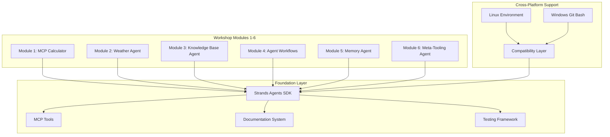

# Workshop 4 Modules Design Document

## Overview

The Workshop 4 Modules design focuses on foundational Agentic AI concepts using Strands Agents SDK, covering modules 1-6 that build progressive understanding from basic MCP tools to complex agent interactions. The design emphasizes modularity, cross-platform compatibility, and clear learning progression to prepare students for advanced multi-agent implementations.

## Architecture

### High-Level Architecture

### Component Architecture

The system follows a progressive learning architecture with clear module separation:

1. **Module Layer**: Individual learning modules with specific objectives
2. **Foundation Layer**: Strands Agents SDK and MCP tools integration
3. **Support Layer**: Documentation, testing, and cross-platform compatibility
4. **Platform Layer**: Linux and Windows (Git Bash) environment support

## Components and Interfaces

### Workshop Content Management

**Workshop Materials Component**
- Manages modular content delivery
- Supports customizable difficulty levels
- Maintains version control for materials
- Provides content validation and consistency checks

**Documentation System**
- Generates interactive documentation
- Maintains API references for Strands Agents SDK
- Provides troubleshooting guides and FAQs
- Supports multiple output formats (web, PDF, markdown)

### Implementation Tracks

**Bedrock Implementation Track**
- Multi-agent examples using Amazon Bedrock models
- Integration patterns with Strands Agents SDK
- Performance optimization techniques
- Cost management strategies

**SageMaker Implementation Track**
- Equivalent multi-agent functionality using SageMaker AI
- Fine-tuning workflows with SageMaker JumpStart
- Custom model deployment as MCP tools
- Hybrid approaches combining multiple model types

**Comparison Framework**
- Side-by-side implementation analysis
- Performance benchmarking tools
- Cost comparison utilities
- Decision matrix for model selection

### Agent Framework Integration

**Strands Agents SDK Wrapper**
- Simplified API for workshop exercises
- Error handling and debugging utilities
- Logging and monitoring integration
- Educational scaffolding for complex concepts

**AgentCore Management**
- Multi-agent orchestration examples using Amazon Bedrock AgentCore
- Communication pattern demonstrations
- State management illustrations
- Coordination protocol implementations

### Infrastructure Management

**AWS CDK Deployment**
- Environment provisioning
- Resource management
- Cost optimization
- Cleanup procedures

## Correctness Properties

*A property is a characteristic or behavior that should hold true across all valid executions of a system-essentially, a formal statement about what the system should do. Properties serve as the bridge between human-readable specifications and machine-verifiable correctness guarantees.*

### Property Reflection

After analyzing all acceptance criteria, several properties can be consolidated to eliminate redundancy:

- Properties 1.1, 1.3, and 3.2 all relate to completeness of materials and can be combined into a comprehensive "Material Completeness" property
- Properties 2.1-2.6 are all specific module examples that can be grouped under "Module Functionality"
- Properties 3.1, 3.3, 3.4, 3.5 all relate to exercise and testing capabilities and can be consolidated into "Exercise System Functionality"
- Properties 4.1-4.5 all relate to modularity and reusability and can be consolidated into "System Modularity"
- Properties 1.2, 1.4, 1.5 relate to system consistency and compatibility

### Core Properties

**Property 1: Material Completeness**
*For any* workshop module (1-6), all required documentation, setup instructions, and tutorial materials should be present and accessible
**Validates: Requirements 1.1, 1.3, 3.2**

**Property 2: Module Progression Consistency**
*For any* sequence of modules, each module should build correctly on previous concepts and enable successful progression from basic to complex implementations
**Validates: Requirements 1.2**

**Property 3: Cross-Platform Compatibility**
*For any* workshop module, the code and instructions should work correctly on both Linux and Windows (Git Bash) environments
**Validates: Requirements 1.5**

**Property 4: Content Consistency**
*For any* workshop content update, all related materials, code examples, and inter-module references should remain consistent and synchronized
**Validates: Requirements 1.4**

**Property 5: Exercise System Functionality**
*For any* workshop module, the exercises should provide proper guidance, validate completion correctly, and enable successful agent interactions
**Validates: Requirements 3.1, 3.3, 3.4, 3.5**

**Property 6: System Modularity**
*For any* workshop customization, modular components should be selectable, configurable for different audiences, and maintain clear separation between foundational and advanced concepts
**Validates: Requirements 4.1, 4.2, 4.3, 4.4, 4.5**

## Error Handling

### Content Management Errors

**Missing Dependencies**
- Detect missing prerequisites or dependencies in workshop materials
- Provide clear error messages with resolution steps
- Maintain fallback content for common missing components

**Version Conflicts**
- Identify incompatible versions between Strands Agents SDK, Amazon Bedrock AgentCore, and workshop materials
- Provide automatic version resolution where possible
- Generate compatibility reports for manual resolution

**Content Validation Failures**
- Validate all code examples and exercises before deployment
- Provide detailed error reports for failed validations
- Support incremental validation during content updates

### Infrastructure Errors

**AWS Resource Provisioning Failures**
- Handle CDK deployment failures with detailed error reporting
- Implement retry mechanisms for transient failures
- Provide rollback capabilities for partial deployments

**Model Integration Errors**
- Detect and handle Bedrock and SageMaker API failures
- Implement circuit breaker patterns for model endpoints
- Provide fallback models for critical workshop functions

**Scaling Limitations**
- Monitor resource usage and participant limits
- Implement graceful degradation when limits are reached
- Provide cost alerts and automatic scaling controls

### Exercise System Errors

**Validation Failures**
- Handle exercise validation errors with helpful feedback
- Provide debugging assistance for common failure patterns
- Support manual override for edge cases

**Agent Communication Failures**
- Detect and recover from multi-agent communication issues
- Provide diagnostic tools for troubleshooting agent interactions
- Implement timeout and retry mechanisms

## Common Issues and Solutions

The workshop materials should include clear guidance for common issues:

**Content Issues**
- Missing prerequisites or dependencies
- Version conflicts between components
- Broken links or outdated references

**Implementation Issues**
- Model integration problems
- Agent communication failures
- Configuration errors

**Setup Issues**
- Environment setup problems
- Authentication and permissions
- Resource availability