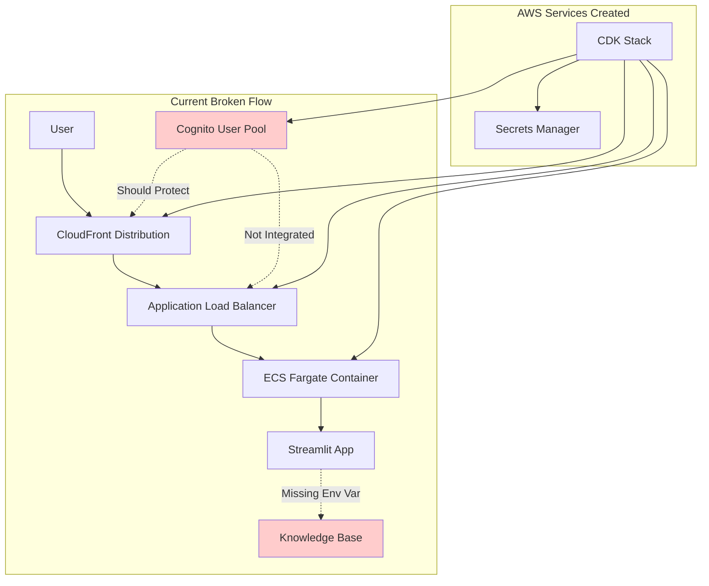

# Multi-Agent Bedrock Deployment Fixes Design Document

## Overview

This design addresses critical issues with the deployed multi-agent Bedrock Streamlit application: (1) a bug where CloudFront bypasses Cognito authentication despite proper CDK configuration, and (2) a missing feature where the STRANDS_KNOWLEDGE_BASE_ID environment variable is not set in the Docker container. The design also includes updating documentation to provide three focused sections for builders.

## Architecture

### Current Deployment Architecture



### Target Fixed Architecture

```mermaid
graph TB
    subgraph "Fixed Authentication Flow"
        USER[User] --> CF[CloudFront Distribution]
        CF --> |Auth Check| LAMBDA[Lambda@Edge Auth]
        LAMBDA --> |Redirect if Unauthenticated| COGNITO[Cognito Hosted UI]
        LAMBDA --> |Authenticated| ALB[Application Load Balancer]
        ALB --> ECS[ECS Fargate Container]
        ECS --> APP[Streamlit App]
        
        APP --> |With Env Var| KB[Knowledge Base]
    end
    
    subgraph "Authentication Integration"
        COGNITO --> |JWT Token| LAMBDA
        SECRETS[Secrets Manager] --> |Cognito Config| LAMBDA
        SECRETS --> |Cognito Config| ECS
    end
    
    style COGNITO fill:#ccffcc
    style KB fill:#ccffcc
    style LAMBDA fill:#ffffcc
```

## Components and Interfaces

### 1. Cognito Authentication Integration (Bug Fix)

**Problem Analysis:**
The existing CDK stack in `workshop4/deploy_multi_agent_bedrock/cdk/cdk_stack.py` creates Cognito resources (user pool, client, secrets) but CloudFront bypasses authentication. Need to debug why the existing configuration doesn't enforce authentication.

**Current CDK Stack Analysis:**
- ✅ Cognito UserPool is created
- ✅ Cognito UserPoolClient is created with secret
- ✅ Secrets Manager stores Cognito configuration
- ❌ CloudFront doesn't enforce authentication (BUG)
- ✅ ALB has custom header protection from CloudFront
- ❌ No Lambda@Edge or other authentication mechanism

**Root Cause Investigation:**
The current CDK stack creates Cognito resources but has no mechanism to enforce authentication at CloudFront level. The authentication should happen before requests reach the ALB.

**Solution Approach:**
Debug and fix the existing CDK stack by adding the missing authentication integration:
- Add Lambda@Edge function to existing CloudFront distribution
- Integrate with existing Cognito UserPool and UserPoolClient
- Use existing Secrets Manager configuration
- Maintain existing ALB custom header protection

### 2. Environment Variable Configuration (Missing Feature)

**Problem Analysis:**
The existing Dockerfile in `workshop4/deploy_multi_agent_bedrock/docker_app/Dockerfile` doesn't include the STRANDS_KNOWLEDGE_BASE_ID environment variable, causing knowledge base functionality to fail in production.

**Current Dockerfile Analysis:**
- ✅ Base Python 3.12 image with ARM64 platform
- ✅ Port 8501 exposed for Streamlit
- ✅ Requirements installation and app copying
- ❌ Missing STRANDS_KNOWLEDGE_BASE_ID environment variable
- ✅ Streamlit run command configured

**Solution Components:**
- **Dockerfile Enhancement**: Add environment variable to existing Dockerfile
- **Builder Documentation**: Clear instructions for customization
- **Source Code Synchronization**: Ensure docker_app matches multi_agent_bedrock
- **Runtime Configuration**: Support environment-specific configuration

**Implementation Approach:**
```dockerfile
# Add to existing Dockerfile in workshop4/deploy_multi_agent_bedrock/docker_app/Dockerfile
# STRANDS_KNOWLEDGE_BASE_ID - Replace with your own Bedrock Knowledge Base ID
# Current value is from the workshop setup - builders must replace with their own KB ID
ENV STRANDS_KNOWLEDGE_BASE_ID="IMW46CITZE"
```

### 3. Source Code Synchronization

**Critical Requirement:**
The source code in `workshop4/deploy_multi_agent_bedrock/docker_app/` (deployed Streamlit app) must be exactly the same as the source code in `workshop4/multi_agent_bedrock/` (local Streamlit app).

**Current State Analysis:**
- Local version: `workshop4/multi_agent_bedrock/app.py` (fully functional with KB integration)
- Deployed version: `workshop4/deploy_multi_agent_bedrock/docker_app/app.py` (may be outdated)
- Need to ensure both versions are identical for consistent functionality

**Synchronization Requirements:**
- Copy latest app.py from multi_agent_bedrock to docker_app
- Copy all supporting files (assistants, cross_platform_tools, etc.)
- Ensure requirements.txt includes all necessary dependencies
- Maintain identical functionality between local and deployed versions

### 4. Documentation Restructure

**Current Problem:**
The MULTI_AGENT_BEDROCK.md file is comprehensive but overwhelming for builders who need focused guidance.

**Solution Structure:**
1. **Local Development Section**: How to run and debug using multi_agent_bedrock
2. **Deployment Section**: Copy files to docker_app, set KB ID, run CDK commands on Ubuntu/Graviton EC2
3. **Production Usage Section**: Add Cognito users and access deployed app with authentication

## Data Models

### Authentication Flow Data

```typescript
interface CognitoAuthRequest {
  event: CloudFrontRequest;
  context: LambdaContext;
  cognitoConfig: {
    userPoolId: string;
    clientId: string;
    domain: string;
  };
}

interface AuthenticationResult {
  isAuthenticated: boolean;
  redirectResponse?: CloudFrontResponse;
  user?: {
    sub: string;
    email: string;
    groups: string[];
  };
}
```

### Environment Configuration

```typescript
interface ContainerEnvironment {
  STRANDS_KNOWLEDGE_BASE_ID: string;
  AWS_REGION: string;
  BYPASS_TOOL_CONSENT: string;
  COGNITO_USER_POOL_ID?: string;
  COGNITO_CLIENT_ID?: string;
}

interface DeploymentConfig {
  stackName: string;
  customHeaderValue: string;
  secretsManagerId: string;
  deploymentRegion: string;
  bedrockRegion: string;
  knowledgeBaseId: string; // New addition
}
```

## Correctness Properties

*A property is a characteristic or behavior that should hold true across all valid executions of a system-essentially, a formal statement about what the system should do. Properties serve as the bridge between human-readable specifications and machine-verifiable correctness guarantees.*

### Property Reflection

After analyzing all acceptance criteria, several properties can be consolidated to eliminate redundancy:

- Properties 1.1, 1.2, 4.2, and 4.4 all relate to authentication enforcement and can be combined into "Authentication Enforcement"
- Properties 1.3, 1.4, and 1.5 all relate to authentication flow handling and can be combined into "Authentication Flow Management"
- Properties 2.1, 5.1, and 5.2 all relate to environment variable configuration and can be combined into "Environment Variable Configuration"
- Properties 2.2, 2.3, and 2.4 all relate to knowledge base functionality and can be combined into "Knowledge Base Integration"
- Properties 4.1 and 4.3 relate to CDK deployment and Cognito integration and can be combined into "CDK Cognito Integration"

### Core Properties

**Property 1: Authentication Enforcement**
*For any* unauthenticated request to CloudFront, the system should redirect to Cognito sign-in and deny access to protected resources
**Validates: Requirements 1.1, 1.2, 4.2, 4.4**

**Property 2: Authentication Flow Management**
*For any* authentication attempt (success, failure, or sign-out), the system should handle the flow correctly with appropriate redirects and session management
**Validates: Requirements 1.3, 1.4, 1.5**

**Property 3: Environment Variable Configuration**
*For any* Docker container deployment, the STRANDS_KNOWLEDGE_BASE_ID environment variable should be properly set and accessible at runtime
**Validates: Requirements 2.1, 5.1, 5.2**

**Property 4: Knowledge Base Integration**
*For any* knowledge base operation (store or retrieve), the system should successfully interact with the Bedrock Knowledge Base when properly configured
**Validates: Requirements 2.2, 2.3, 2.4**

**Property 5: CDK Cognito Integration**
*For any* CDK deployment, the system should create properly configured Cognito resources and integrate them with CloudFront authentication
**Validates: Requirements 4.1, 4.3**

**Property 6: Environment-Specific Configuration Support**
*For any* deployment environment, the system should support environment-specific configuration and provide helpful error messages when configuration is missing
**Validates: Requirements 5.4, 5.5**

<function_calls>
<invoke name="prework">
<parameter name="featureName">workshop4-multi-agent-bedrock-fix

## Error Handling

### Authentication Errors

**Lambda@Edge Function Failures**
- Handle Lambda execution errors gracefully with fallback to deny access
- Implement proper logging for debugging authentication issues
- Provide clear error messages for common authentication failures
- Support retry mechanisms for transient failures

**Cognito Integration Errors**
- Handle Cognito service unavailability with appropriate error pages
- Validate JWT tokens with proper error handling for expired/invalid tokens
- Implement graceful degradation when Cognito hosted UI is unavailable
- Provide clear user feedback for authentication state issues

**Session Management Errors**
- Handle session timeout scenarios with automatic redirect to sign-in
- Implement proper cleanup for invalid or corrupted sessions
- Support concurrent session management and conflict resolution
- Provide clear messaging for session-related errors

### Environment Configuration Errors

**Missing Environment Variables**
- Detect missing STRANDS_KNOWLEDGE_BASE_ID at container startup
- Provide clear error messages indicating which variables are missing
- Support graceful degradation when knowledge base is unavailable
- Log configuration issues for debugging and monitoring

**Knowledge Base Connection Errors**
- Handle Bedrock Knowledge Base service unavailability
- Implement retry logic for transient knowledge base failures
- Provide user-friendly error messages for knowledge base operations
- Support fallback behavior when knowledge base is inaccessible

**CDK Deployment Errors**
- Validate Cognito resource creation during deployment
- Handle partial deployment failures with proper rollback
- Provide clear error messages for CDK stack issues
- Support deployment validation and health checks

## Testing Strategy

### Dual Testing Approach

The testing strategy combines unit testing and property-based testing to ensure comprehensive coverage:

**Unit Testing**
- Test individual Lambda@Edge function behaviors with mock events
- Validate Cognito integration points and token validation logic
- Test Docker container environment variable configuration
- Verify CDK stack resource creation and configuration

**Property-Based Testing**
- Use pytest with Hypothesis (Python) for property-based testing framework
- Configure each property-based test to run minimum 100 iterations
- Test authentication flows with random user scenarios and token states
- Validate environment configuration across different deployment scenarios

**Property-Based Test Requirements**
- Each correctness property must be implemented by a single property-based test
- Tests must be tagged with format: '**Feature: workshop4-multi-agent-bedrock-fix, Property {number}: {property_text}**'
- Tests should generate random authentication scenarios and validate properties hold
- Focus on security correctness, configuration validation, and deployment reliability

**Integration Testing**
- Test end-to-end authentication flow from CloudFront to Streamlit app
- Validate knowledge base functionality in deployed environment
- Test CDK deployment and resource creation in multiple AWS accounts
- Verify documentation accuracy through automated deployment testing

## Implementation Approach

### Phase 1: Debug and Fix Authentication (Bug Resolution)

1. **Analyze Existing CDK Stack**
   - Review `workshop4/deploy_multi_agent_bedrock/cdk/cdk_stack.py` in detail
   - Identify why Cognito resources aren't enforcing authentication
   - Determine what's missing for CloudFront authentication integration

2. **Implement Missing Authentication Components**
   - Add Lambda@Edge function to existing CloudFront distribution
   - Integrate with existing Cognito UserPool and UserPoolClient
   - Use existing Secrets Manager configuration for Cognito parameters
   - Maintain existing ALB custom header protection

3. **Test Authentication Flow**
   - Deploy updated CDK stack
   - Verify unauthenticated requests redirect to Cognito
   - Test successful authentication grants access to Streamlit app
   - Validate session management and sign-out functionality

### Phase 2: Add Environment Variable (Missing Feature)

1. **Update Existing Dockerfile**
   - Modify `workshop4/deploy_multi_agent_bedrock/docker_app/Dockerfile`
   - Add STRANDS_KNOWLEDGE_BASE_ID environment variable with current value
   - Include clear documentation comments for builders to customize

2. **Synchronize Source Code**
   - Copy latest files from `workshop4/multi_agent_bedrock/` to `workshop4/deploy_multi_agent_bedrock/docker_app/`
   - Ensure app.py and all supporting files are identical
   - Verify requirements.txt includes all necessary dependencies

3. **Test Knowledge Base Integration**
   - Rebuild and redeploy Docker container
   - Verify knowledge base functionality works in deployed environment
   - Test error handling when environment variables are missing
   - Validate builder customization scenarios

### Phase 3: Documentation Update

1. **Restructure MULTI_AGENT_BEDROCK.md**
   - Create three focused sections as specified
   - Remove overwhelming detail and focus on actionable steps
   - Include clear examples and troubleshooting guidance

2. **Add Deployment Validation**
   - Include steps to verify Cognito authentication is working
   - Add knowledge base functionality testing instructions
   - Provide troubleshooting guide for common issues

## Security Considerations

### Authentication Security

- **JWT Token Validation**: Proper validation of Cognito JWT tokens in Lambda@Edge
- **Session Security**: Secure session management with appropriate timeouts
- **HTTPS Enforcement**: Ensure all authentication flows use HTTPS
- **CSRF Protection**: Implement CSRF protection for authentication endpoints

### Environment Security

- **Secrets Management**: Use AWS Secrets Manager for sensitive configuration
- **Environment Variable Security**: Avoid exposing sensitive data in environment variables
- **Access Control**: Implement least-privilege access for all AWS resources
- **Audit Logging**: Log authentication events and configuration changes

## Deployment Validation

### Authentication Validation Steps

1. **Unauthenticated Access Test**
   ```bash
   curl -I https://your-cloudfront-domain.cloudfront.net
   # Should return 302 redirect to Cognito
   ```

2. **Cognito User Creation Test**
   ```bash
   aws cognito-idp admin-create-user \
     --user-pool-id YOUR_POOL_ID \
     --username testuser \
     --temporary-password TempPass123!
   ```

3. **Authenticated Access Test**
   - Sign in through Cognito hosted UI
   - Verify access to Streamlit application
   - Test knowledge base functionality

### Environment Configuration Validation

1. **Container Environment Check**
   ```bash
   docker run --rm your-image env | grep STRANDS_KNOWLEDGE_BASE_ID
   # Should show the environment variable
   ```

2. **Knowledge Base Functionality Test**
   - Submit knowledge storage query: "Remember that my name is John"
   - Submit knowledge retrieval query: "What is my name?"
   - Verify both operations work correctly

3. **Error Handling Test**
   - Remove environment variable and test error messages
   - Verify graceful degradation when KB is unavailable