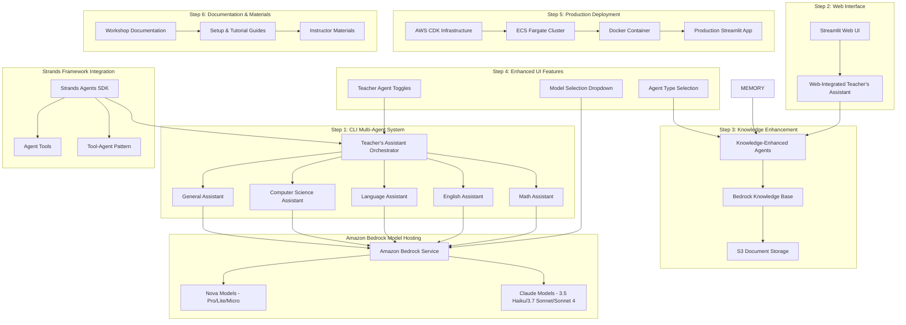

# Multi-Agent System using Strands Agents and Amazon Bedrock Design Document

## Overview

This design focuses on Module 7: Building Multi-Agent with Strands using Amazon Bedrock model hosting. The design follows a 6-step progressive approach: (1) CLI multi-agent system using Teacher's Assistant pattern, (2) Streamlit web interface integration, (3) Bedrock Knowledge Base enhancement, (4) Memory integration and enhanced UI features, (5) production deployment using AWS CDK, Docker, and ECS Fargate, and (6) comprehensive documentation and workshop materials. Strands Agents SDK provides the multi-agent framework while Amazon Bedrock hosts the foundation models.

## Architecture

### High-Level 6-Step Architecture



### Component Architecture

The system follows a progressive 6-step architecture with clear learning progression:

1. **Step 1 - CLI Foundation**: Teacher's Assistant pattern with 5 specialized agents using Tool-Agent Pattern
2. **Step 2 - Web Interface**: Streamlit integration for user-friendly web-based interactions
3. **Step 3 - Knowledge Enhancement**: Bedrock Knowledge Base integration with S3 document storage
4. **Step 4 - Enhanced UI Features**: Model selection and agent customization features
5. **Step 5 - Production Deployment**: AWS CDK infrastructure with Docker containerization and ECS Fargate hosting
6. **Step 6 - Documentation & Materials**: Comprehensive workshop documentation and instructor resources

## Components and Interfaces

### Step 1: CLI Multi-Agent System

**Teacher's Assistant (Orchestrator)**
- Central coordinator that analyzes natural language queries
- Routes queries to appropriate specialized agents using system prompts
- Implements Tool-Agent Pattern with agents as tools
- Suppresses intermediate output using callback_handler=None

**Specialized Agents (Tool-Agent Pattern)**
- Math Assistant: Handles mathematical calculations using calculator tool
- English Assistant: Processes grammar and language comprehension
- Language Assistant: Manages translations using http_request tool
- Computer Science Assistant: Handles programming using python_repl, shell, editor, file operations
- General Assistant: Processes queries outside specialized domains (no specific tools)

### Step 2: Streamlit Web Interface

**Web UI Integration**
- Streamlit application that wraps the Teacher's Assistant system
- Clean web interface for query submission and response display
- Proper formatting of agent responses in web format
- Error handling and user feedback mechanisms

**Web-Integrated Multi-Agent System**
- Same Teacher's Assistant pattern adapted for web interface
- Maintains all specialized agent capabilities
- Provides better user experience than command-line interface

### Step 3: Knowledge Base Enhancement

**Bedrock Knowledge Base Integration**
- AWS Bedrock Knowledge Base service for document storage and retrieval
- S3 bucket integration for document management
- Enhanced agent capabilities with document retrieval
- Knowledge-augmented responses from specialized agents

**Document Management**
- Document upload and indexing workflows
- S3 storage management and organization
- Knowledge base querying and retrieval patterns
- Integration with existing specialized agents

### Step 4: Enhanced UI Features

**Model Selection**
- Dropdown selection for multiple Bedrock model options:
  - us.amazon.nova-pro-v1:0 (Amazon Nova Pro)
  - us.amazon.nova-lite-v1:0 (Amazon Nova Lite) 
  - us.amazon.nova-micro-v1:0 (Amazon Nova Micro)
  - anthropic.claude-3-5-haiku-20241022-v1:0 (Claude 3.5 Haiku)
  - anthropic.claude-3-7-sonnet-20250219-v1:0 (Claude 3.7 Sonnet)
  - anthropic.claude-sonnet-4-20250514-v1:0 (Claude Sonnet 4)

**Teacher Agent Customization**
- Individual toggle controls for each specialized teacher agent
- Dynamic agent selection: Math, Language, Computer Science, English assistants
- Configurable agent combinations based on user preferences
- Maintains existing Tool-Agent Pattern with selective activation

**Agent Type Selection**
- Dropdown selection between Teacher Agent, Knowledge Base, and Auto-Route
- Direct routing to specific agent types based on user preference
- Auto-Route option maintains existing intelligent routing logic

### Step 5: Production Deployment

**Containerization**
- Docker container packaging of the Streamlit multi-agent application
- Container optimization for production deployment with enhanced features
- Environment configuration and dependency management
- Testing container locally with full feature set validation

**AWS CDK Infrastructure**
- Infrastructure as Code for ECS Fargate cluster deployment
- Supporting AWS services (VPC, Load Balancer, etc.)
- Monitoring and logging infrastructure for multi-agent system
- Cost optimization and resource management for production workloads

**ECS Fargate Deployment**
- Serverless container hosting for the enhanced multi-agent application
- Auto-scaling and high availability configuration
- Production monitoring and maintenance procedures

### Step 6: Documentation and Workshop Materials

**Comprehensive Documentation**
- Complete 6-step workshop documentation with setup guides
- Detailed tutorials for each step with clear progression
- Troubleshooting and FAQ documentation for enhanced features
- Instructor guide and presentation materials

**Modular Component Documentation**
- Reusable multi-agent patterns and components
- Customization and adaptation guides for model selection and agent toggles
- Integration APIs and interface documentation
- Performance tuning guides for different Bedrock models

## Data Models

### Agent Communication Protocol

```typescript
interface AgentMessage {
  id: string;
  sender: AgentId;
  recipients: AgentId[];
  messageType: MessageType;
  payload: any;
  timestamp: Date;
  correlationId?: string;
}

interface WorkflowState {
  workflowId: string;
  currentStep: number;
  totalSteps: number;
  status: WorkflowStatus;
  agentStates: Map<AgentId, AgentState>;
  results: WorkflowResult[];
}
```

### Agent Configuration

```typescript
interface AgentConfig {
  agentId: string;
  role: AgentRole;
  bedrockModel: BedrockModelConfig;
  capabilities: string[];
  communicationPatterns: CommunicationPattern[];
  resourceLimits: ResourceLimits;
}

interface BedrockModelConfig {
  modelId: string;
  modelParameters: ModelParameters;
  fallbackModels: string[];
  costOptimization: CostSettings;
}
```

## Correctness Properties

*A property is a characteristic or behavior that should hold true across all valid executions of a system-essentially, a formal statement about what the system should do. Properties serve as the bridge between human-readable specifications and machine-verifiable correctness guarantees.*

### Property Reflection

After analyzing all acceptance criteria, several properties can be consolidated to eliminate redundancy:

- Properties 1.1 and related documentation requirements can be combined into "Material Completeness"
- Properties 1.2-1.7 all relate to step completion and can be grouped under "6-Step Progression Correctness"
- Properties 2.1-2.5 all relate to CLI multi-agent functionality and can be consolidated into "CLI Multi-Agent System Functionality"
- Properties 3.1-3.5 all relate to web interface and can be consolidated into "Web Interface Integration"
- Properties 4.1-4.5 all relate to knowledge base integration and can be consolidated into "Knowledge Base Integration"
- Properties 5.1-5.5 all relate to memory integration and enhanced UI and can be consolidated into "Memory Integration and Enhanced UI"
- Properties 6.1-6.5 all relate to modularity and reusability and can be consolidated into "System Modularity and Configuration"
- Properties 7.1-7.5 all relate to production deployment and can be consolidated into "Production Deployment Correctness"
- Properties 8.1-8.5 all relate to documentation and materials and can be consolidated into "Material Completeness"

### Core Properties

**Property 1: Material Completeness**
*For any* workshop step (1-6), all required documentation, setup instructions, and tutorial materials should be present and accessible
**Validates: Requirements 1.1, 8.1, 8.2, 8.3, 8.4, 8.5**

**Property 2: 6-Step Progression Correctness**
*For any* completed workshop step, the implementation should work correctly and enable progression to the next step (CLI → UI → Knowledge → Memory/UI → Deployment → Documentation)
**Validates: Requirements 1.2, 1.3, 1.4, 1.5, 1.6, 1.7**

**Property 3: CLI Multi-Agent System Functionality**
*For any* query submitted to the Teacher's Assistant system, it should route correctly to the appropriate specialized agent and return a proper response using Bedrock models
**Validates: Requirements 2.1, 2.2, 2.3, 2.4, 2.5**

**Property 4: Web Interface Integration**
*For any* query submitted through the Streamlit web interface, it should integrate correctly with the multi-agent system and display properly formatted responses
**Validates: Requirements 3.1, 3.2, 3.3, 3.4, 3.5**

**Property 5: Knowledge Base Integration**
*For any* document stored in the Bedrock Knowledge Base, agents should be able to retrieve and use relevant information correctly in their responses
**Validates: Requirements 4.1, 4.2, 4.3, 4.4, 4.5**

**Property 6: Enhanced UI Features**
*For any* UI enhancement (model selection/agent toggles/agent type selection), the system should integrate correctly with existing multi-agent functionality while providing proper user controls
**Validates: Requirements 5.1, 5.2, 5.3**

**Property 7: Production Deployment Correctness**
*For any* production deployment using CDK, Docker, and ECS Fargate, the containerized multi-agent application should run correctly with proper monitoring and maintenance capabilities
**Validates: Requirements 7.1, 7.2, 7.3, 7.4, 7.5**

**Property 8: System Modularity and Configuration**
*For any* customization or extension of the multi-agent system, modular components should be configurable, reusable, and maintain clear separation between application logic and configuration
**Validates: Requirements 6.1, 6.2, 6.3, 6.4**

## Error Handling

### Multi-Agent Coordination Errors

**Agent Communication Failures**
- Detect and handle message delivery failures between agents
- Implement retry mechanisms with exponential backoff
- Provide circuit breaker patterns for failing agents
- Maintain message ordering and delivery guarantees

**Workflow Orchestration Errors**
- Handle partial workflow failures with proper rollback
- Implement checkpoint and resume capabilities
- Provide workflow state recovery mechanisms
- Support manual intervention and override capabilities

**Agent Role Conflicts**
- Detect and resolve conflicting agent decisions
- Implement consensus mechanisms for critical decisions
- Provide conflict resolution protocols and escalation paths
- Maintain audit trails for decision-making processes

### Amazon Bedrock Integration Errors

**Model Availability Issues**
- Handle Bedrock service outages and model unavailability
- Implement automatic fallback to alternative models
- Provide graceful degradation of agent capabilities
- Monitor model performance and availability metrics

**Rate Limiting and Throttling**
- Implement intelligent request queuing and batching
- Provide backpressure mechanisms for high-load scenarios
- Monitor and optimize API usage patterns
- Support dynamic rate limit adjustment

**Cost Management Errors**
- Monitor and alert on unexpected cost increases
- Implement cost caps and automatic scaling limits
- Provide cost optimization recommendations
- Support budget-based resource allocation

### Infrastructure and Deployment Errors

**CDK Deployment Failures**
- Handle partial infrastructure deployments with proper cleanup
- Implement infrastructure validation and testing
- Provide rollback capabilities for failed deployments
- Support incremental infrastructure updates

**Scaling and Performance Issues**
- Monitor agent performance and resource utilization
- Implement automatic scaling based on workload demands
- Provide performance optimization recommendations
- Support load testing and capacity planning

## Testing Strategy

### Dual Testing Approach

The testing strategy combines unit testing and property-based testing to ensure comprehensive coverage:

**Unit Testing**
- Test individual agent behaviors and responses
- Validate specific coordination scenarios and edge cases
- Test Bedrock integration points and error conditions
- Verify infrastructure deployment and configuration

**Property-Based Testing**
- Use Hypothesis (Python) for property-based testing framework
- Configure each property-based test to run minimum 100 iterations
- Test universal properties across all multi-agent scenarios
- Validate coordination patterns with random agent configurations

**Property-Based Test Requirements**
- Each correctness property must be implemented by a single property-based test
- Tests must be tagged with format: '**Feature: workshop4-multi-agent-bedrock, Property {number}: {property_text}**'
- Tests should generate random multi-agent scenarios and validate properties hold
- Focus on coordination correctness, error handling, and system reliability

**Integration Testing**
- Test end-to-end multi-agent workflows with real Bedrock models
- Validate infrastructure deployment in multiple environments
- Test cross-platform compatibility and performance
- Verify monitoring and logging functionality

## Common Issues and Solutions

**Multi-Agent Coordination Issues**
- Agent communication timeouts and message loss
- Workflow deadlocks and circular dependencies
- Resource contention and performance bottlenecks
- Inconsistent agent state and decision conflicts

**Bedrock Integration Issues**
- Model selection and optimization challenges
- API rate limiting and cost management
- Model availability and fallback scenarios
- Performance optimization for multi-agent scenarios

**Infrastructure Issues**
- CDK deployment and configuration problems
- Scaling and resource management challenges
- Monitoring and observability setup
- Cost optimization and resource cleanup