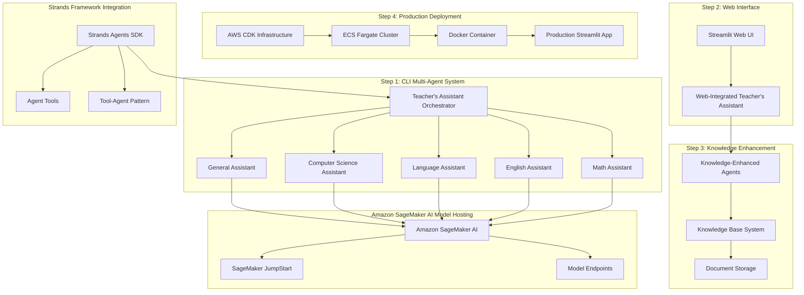

# Multi-Agent System using Strands Agents and Amazon SageMaker AI Design Document

## Overview

This design focuses on Module 7: Building Multi-Agent with Strands using Amazon SageMaker AI model hosting as a side-by-side analog to the Bedrock version. The design follows the same 4-step progressive approach: (1) CLI multi-agent system using Teacher's Assistant pattern, (2) Streamlit web interface integration, (3) knowledge base enhancement, and (4) production deployment using AWS CDK, Docker, and ECS Fargate. The key difference is using SageMaker AI (JumpStart) models instead of Bedrock models for agent model hosting and inference.

## Architecture

### High-Level 4-Step Architecture



### Component Architecture

The system follows the same progressive 4-step architecture as the Bedrock version with SageMaker AI model hosting:

1. **Step 1 - CLI Foundation**: Teacher's Assistant pattern with 5 specialized agents using Tool-Agent Pattern with SageMaker JumpStart models
2. **Step 2 - Web Interface**: Streamlit integration for user-friendly web-based interactions with SageMaker-powered agents
3. **Step 3 - Knowledge Enhancement**: Knowledge base integration compatible with SageMaker AI model hosting
4. **Step 4 - Production Deployment**: AWS CDK infrastructure with Docker containerization and ECS Fargate hosting with SageMaker AI access

## Components and Interfaces

### Step 1: CLI Multi-Agent System with SageMaker AI

**Teacher's Assistant (Orchestrator)**
- Central coordinator that analyzes natural language queries
- Routes queries to appropriate specialized agents using system prompts
- Implements Tool-Agent Pattern with agents as tools using SageMaker JumpStart models
- Suppresses intermediate output using callback_handler=None

**Specialized Agents (Tool-Agent Pattern with SageMaker Models)**
- Math Assistant: Handles mathematical calculations using calculator tool with SageMaker model hosting
- English Assistant: Processes grammar and language comprehension using SageMaker models
- Language Assistant: Manages translations using http_request tool with SageMaker model integration
- Computer Science Assistant: Handles programming using python_repl, shell, editor, file operations with SageMaker models
- General Assistant: Processes queries outside specialized domains using SageMaker JumpStart models (no specific tools)

### Step 2: Streamlit Web Interface with SageMaker Integration

**Web UI Integration**
- Streamlit application that wraps the SageMaker-based Teacher's Assistant system
- Clean web interface for query submission and response display with SageMaker model responses
- Proper formatting of SageMaker agent responses in web format
- Error handling and user feedback mechanisms for SageMaker model integration issues

**Web-Integrated Multi-Agent System**
- Same Teacher's Assistant pattern adapted for web interface with SageMaker AI models
- Maintains all specialized agent capabilities with SageMaker model hosting
- Provides better user experience than command-line interface for SageMaker workflows

### Step 3: Knowledge Base Enhancement with SageMaker AI

**Knowledge Base Integration**
- Knowledge base system compatible with SageMaker AI model hosting
- Document storage and retrieval integrated with SageMaker model workflows
- Enhanced agent capabilities with document retrieval using SageMaker models
- Knowledge-augmented responses from SageMaker-powered specialized agents

**Document Management**
- Document upload and indexing workflows compatible with SageMaker AI
- Document storage management and organization for SageMaker model access
- Knowledge base querying and retrieval patterns optimized for SageMaker workflows
- Integration with existing SageMaker-based specialized agents

### Step 4: Production Deployment with SageMaker AI

**Containerization**
- Docker container packaging of the Streamlit multi-agent application with SageMaker AI integration
- Container optimization for production deployment with SageMaker model access
- Environment configuration and dependency management for SageMaker AI workflows

**AWS CDK Infrastructure**
- Infrastructure as Code for ECS Fargate cluster with SageMaker AI access and permissions
- Supporting AWS services (VPC, Load Balancer, etc.) configured for SageMaker integration
- Monitoring and logging infrastructure for SageMaker model performance
- Cost optimization and resource management for SageMaker AI usage

**ECS Fargate Deployment**
- Serverless container hosting for the SageMaker-based multi-agent application
- Auto-scaling and high availability configuration with SageMaker model integration
- Production monitoring and maintenance procedures for SageMaker AI workflows

## Data Models

### Model Configuration and Metadata

```typescript
interface ModelConfig {
  modelId: string;
  modelType: ModelType; // 'fine-tuned-llm' | 'classification' | 'foundation'
  sagemakerEndpoint?: string;
  lambdaFunction?: string;
  performanceMetrics: ModelMetrics;
  costMetrics: CostMetrics;
  capabilities: ModelCapability[];
}

interface ModelMetrics {
  latency: number;
  throughput: number;
  accuracy?: number;
  confidence?: number;
  lastUpdated: Date;
}

interface AgentModelBinding {
  agentId: string;
  primaryModel: ModelConfig;
  fallbackModels: ModelConfig[];
  routingRules: ModelRoutingRule[];
  performanceThresholds: PerformanceThreshold[];
}
```

### Fine-Tuning and Training Configuration

```typescript
interface FineTuningConfig {
  baseModel: string;
  trainingData: TrainingDataConfig;
  hyperparameters: HyperparameterConfig;
  evaluationMetrics: string[];
  deploymentConfig: DeploymentConfig;
}

interface ClassificationModelConfig {
  modelType: string;
  features: FeatureConfig[];
  labels: string[];
  trainingConfig: TrainingConfig;
  lambdaConfig: LambdaDeploymentConfig;
}
```

## Correctness Properties

*A property is a characteristic or behavior that should hold true across all valid executions of a system-essentially, a formal statement about what the system should do. Properties serve as the bridge between human-readable specifications and machine-verifiable correctness guarantees.*

### Property Reflection

After analyzing all acceptance criteria, several properties can be consolidated to eliminate redundancy:

- Properties 1.1 and related documentation requirements can be combined into "Material Completeness"
- Properties 1.2-1.5 all relate to step completion and can be grouped under "4-Step Progression Correctness"
- Properties 2.1-2.5 all relate to CLI multi-agent functionality and can be consolidated into "CLI Multi-Agent System Functionality"
- Properties 3.1-3.5 all relate to web interface and can be consolidated into "Web Interface Integration"
- Properties 4.1-4.5 all relate to knowledge base integration and can be consolidated into "Knowledge Base Integration"
- Properties 5.1-5.5 all relate to deployment and can be consolidated into "Production Deployment Correctness"
- Properties 6.1-6.5 all relate to modularity and reusability and can be consolidated into "System Modularity"

### Core Properties

**Property 1: Material Completeness**
*For any* workshop step (1-4), all required documentation, setup instructions, and tutorial materials should be present and accessible for SageMaker AI integration
**Validates: Requirements 1.1**

**Property 2: 4-Step Progression Correctness**
*For any* completed workshop step, the SageMaker AI implementation should work correctly and enable progression to the next step (CLI → UI → Knowledge → Deployment)
**Validates: Requirements 1.2, 1.3, 1.4, 1.5**

**Property 3: CLI Multi-Agent System Functionality**
*For any* query submitted to the Teacher's Assistant system, it should route correctly to the appropriate specialized agent and return a proper response using SageMaker AI models
**Validates: Requirements 2.1, 2.2, 2.3, 2.4, 2.5**

**Property 4: Web Interface Integration**
*For any* query submitted through the Streamlit web interface, it should integrate correctly with the SageMaker-based multi-agent system and display properly formatted responses
**Validates: Requirements 3.1, 3.2, 3.3, 3.4, 3.5**

**Property 5: Knowledge Base Integration**
*For any* document stored in the knowledge base system, SageMaker-powered agents should be able to retrieve and use relevant information correctly in their responses
**Validates: Requirements 4.1, 4.2, 4.3, 4.4, 4.5**

**Property 6: Production Deployment Correctness**
*For any* production deployment using CDK, Docker, and ECS Fargate, the containerized SageMaker-based multi-agent application should run correctly with proper monitoring and maintenance capabilities
**Validates: Requirements 5.1, 5.2, 5.3, 5.4, 5.5**

**Property 7: System Modularity**
*For any* customization or extension of the SageMaker-based multi-agent system, modular components should be configurable, reusable, and maintain clear separation between application logic and SageMaker AI infrastructure
**Validates: Requirements 6.1, 6.2, 6.3, 6.4, 6.5**

## Error Handling

### Model Training and Deployment Errors

**Fine-Tuning Pipeline Failures**
- Handle SageMaker training job failures with proper error reporting
- Implement automatic retry mechanisms for transient failures
- Provide rollback capabilities for failed model deployments
- Support manual intervention and debugging for complex failures

**Model Endpoint Issues**
- Detect and handle model endpoint failures and unavailability
- Implement automatic failover to backup models or endpoints
- Provide graceful degradation when models are unavailable
- Monitor endpoint performance and implement auto-scaling

**Lambda Function Deployment Errors**
- Handle Lambda deployment failures for classification models
- Implement proper error handling for MCP tool wrapper failures
- Provide debugging capabilities for serverless model integration
- Support version rollback and deployment validation

### Multi-Agent Coordination with Custom Models

**Model Performance Degradation**
- Monitor model performance metrics and detect degradation
- Implement automatic model switching based on performance thresholds
- Provide alerts and notifications for model performance issues
- Support A/B testing and gradual model rollouts

**Agent-Model Integration Failures**
- Handle failures in agent-model communication and integration
- Implement retry mechanisms and circuit breaker patterns
- Provide comprehensive logging for debugging integration issues
- Support dynamic model binding and agent reconfiguration

**Hybrid System Coordination Errors**
- Handle coordination failures between different model types
- Implement consensus mechanisms for conflicting model outputs
- Provide conflict resolution protocols for hybrid agent decisions
- Maintain audit trails for model selection and routing decisions

### Infrastructure and Cost Management Errors

**Resource Provisioning Failures**
- Handle CDK deployment failures for SageMaker resources
- Implement proper cleanup for partially deployed infrastructure
- Provide validation and testing for infrastructure deployments
- Support incremental updates and rollback capabilities

**Cost Management and Optimization**
- Monitor and alert on unexpected cost increases from model usage
- Implement cost caps and automatic resource scaling limits
- Provide cost optimization recommendations and analysis
- Support budget-based resource allocation and management

## Testing Strategy

### Dual Testing Approach

The testing strategy combines unit testing and property-based testing with special focus on model integration:

**Unit Testing**
- Test individual model training and deployment workflows
- Validate specific agent-model integration scenarios and edge cases
- Test SageMaker AI service integration points and error conditions
- Verify infrastructure deployment and model endpoint configuration

**Property-Based Testing**
- Use Hypothesis (Python) for property-based testing framework
- Configure each property-based test to run minimum 100 iterations
- Test universal properties across all model types and agent configurations
- Validate model performance and coordination patterns with random scenarios

**Model Integration Testing**
- Test end-to-end model training, deployment, and agent integration workflows
- Validate fine-tuning pipelines with different model types and configurations
- Test classification model deployment as Lambda functions and MCP tools
- Verify hybrid model coordination and performance optimization

**Property-Based Test Requirements**
- Each correctness property must be implemented by a single property-based test
- Tests must be tagged with format: '**Feature: workshop4-multi-agent-sagemaker-ai, Property {number}: {property_text}**'
- Tests should generate random model configurations and validate properties hold
- Focus on model integration correctness, performance optimization, and system reliability

**Performance and Cost Testing**
- Test model performance under various load conditions
- Validate cost optimization and resource management
- Test scaling behavior for different model types and agent configurations
- Verify monitoring and alerting functionality

## Common Issues and Solutions

**Model Training and Deployment Issues**
- SageMaker training job failures and resource limitations
- Model endpoint deployment and scaling challenges
- Lambda function packaging and deployment for classification models
- Model versioning and rollback complexities

**Agent-Model Integration Issues**
- Model performance variability and optimization challenges
- Agent coordination with different model response patterns
- Cost management and resource optimization for multiple models
- Debugging and troubleshooting hybrid model systems

**Infrastructure and Scaling Issues**
- CDK deployment complexity for SageMaker resources
- Cost management and optimization across multiple model types
- Monitoring and observability for distributed model systems
- Security and access control for model endpoints and data