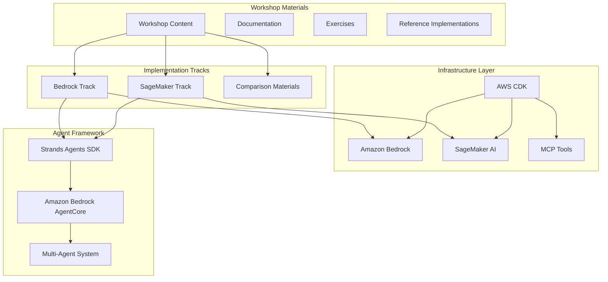

# Workshop 4 Preparation Design Document

## Overview

The Workshop 4 preparation system creates comprehensive, reusable educational materials for Agentic AI development using Strands Agents SDK and AgentCore. The system implements a dual-track approach with both Amazon Bedrock and SageMaker AI implementations, providing students with hands-on experience in multi-agent systems and different AI model integration patterns.

The design emphasizes modularity and reusability, enabling instructors to customize content for different audiences while maintaining consistency across implementations. The workshop infrastructure is deployed using AWS CDK, ensuring reliable and scalable environments for hands-on exercises.

## Architecture

### High-Level Architecture

### Component Architecture

The system follows a layered architecture with clear separation of concerns:

1. **Content Layer**: Workshop materials, documentation, and exercises
2. **Implementation Layer**: Bedrock and SageMaker specific implementations
3. **Framework Layer**: Strands Agents SDK and Amazon Bedrock AgentCore integration
4. **Infrastructure Layer**: AWS CDK deployment and resource management

## Components and Interfaces

### Workshop Content Management

**Workshop Materials Component**
- Manages modular content delivery
- Supports customizable difficulty levels
- Maintains version control for materials
- Provides content validation and consistency checks

**Documentation System**
- Generates interactive documentation
- Maintains API references for Strands Agents SDK
- Provides troubleshooting guides and FAQs
- Supports multiple output formats (web, PDF, markdown)

### Implementation Tracks

**Bedrock Implementation Track**
- Multi-agent examples using Amazon Bedrock models
- Integration patterns with Strands Agents SDK
- Performance optimization techniques
- Cost management strategies

**SageMaker Implementation Track**
- Equivalent multi-agent functionality using SageMaker AI
- Fine-tuning workflows with SageMaker JumpStart
- Custom model deployment as MCP tools
- Hybrid approaches combining multiple model types

**Comparison Framework**
- Side-by-side implementation analysis
- Performance benchmarking tools
- Cost comparison utilities
- Decision matrix for model selection

### Agent Framework Integration

**Strands Agents SDK Wrapper**
- Simplified API for workshop exercises
- Error handling and debugging utilities
- Logging and monitoring integration
- Educational scaffolding for complex concepts

**AgentCore Management**
- Multi-agent orchestration examples using Amazon Bedrock AgentCore
- Communication pattern demonstrations
- State management illustrations
- Coordination protocol implementations

### Infrastructure Management

**AWS CDK Deployment**
- Environment provisioning
- Resource management
- Cost optimization
- Cleanup procedures

## Correctness Properties

*A property is a characteristic or behavior that should hold true across all valid executions of a system-essentially, a formal statement about what the system should do. Properties serve as the bridge between human-readable specifications and machine-verifiable correctness guarantees.*

### Property Reflection

After analyzing all acceptance criteria, several properties can be consolidated to eliminate redundancy:

- Properties 1.1, 1.3, and 2.5 all relate to completeness of materials and can be combined into a comprehensive "Material Completeness" property
- Properties 2.1, 2.2, and 3.1-3.5 all relate to implementation functionality and can be grouped under "Implementation Correctness" 
- Properties 4.1-4.5 all relate to infrastructure management and can be consolidated into "Infrastructure Reliability"
- Properties 5.1-5.5 all relate to exercise functionality and can be combined into "Exercise System Functionality"
- Properties 6.1-6.5 all relate to modularity and reusability and can be consolidated into "System Modularity"

### Core Properties

**Property 1: Material Completeness**
*For any* workshop configuration, all required documentation, setup instructions, and tutorial materials should be present and accessible
**Validates: Requirements 1.1, 1.3, 2.5**

**Property 2: Implementation Equivalence**
*For any* multi-agent example, both Bedrock and SageMaker implementations should provide equivalent functionality and produce comparable results
**Validates: Requirements 2.1, 2.2**

**Property 3: Framework Integration**
*For any* deployed model (fine-tuned LLM or classification model), it should integrate properly with the Strands Agents SDK architecture and function as expected
**Validates: Requirements 3.1, 3.2, 3.3, 3.4, 3.5**

**Property 4: Infrastructure Reliability**
*For any* workshop deployment, AWS CDK should provision all required resources, support multiple environments, scale appropriately, and clean up completely
**Validates: Requirements 4.1, 4.2, 4.3, 4.4, 4.5**

**Property 5: Exercise Validation**
*For any* workshop exercise, the system should provide proper guidance, validate completion correctly, and enable successful multi-agent interactions
**Validates: Requirements 2.4, 5.1, 5.2, 5.3, 5.4, 5.5**

**Property 6: Content Consistency**
*For any* workshop content update, all related materials, code examples, and documentation should remain consistent and synchronized
**Validates: Requirements 1.4**

**Property 7: System Modularity**
*For any* workshop customization, modular components should be selectable, configurable for different audiences, and maintain backward compatibility
**Validates: Requirements 1.5, 6.1, 6.2, 6.3, 6.4, 6.5**

## Error Handling

### Content Management Errors

**Missing Dependencies**
- Detect missing prerequisites or dependencies in workshop materials
- Provide clear error messages with resolution steps
- Maintain fallback content for common missing components

**Version Conflicts**
- Identify incompatible versions between Strands Agents SDK, Amazon Bedrock AgentCore, and workshop materials
- Provide automatic version resolution where possible
- Generate compatibility reports for manual resolution

**Content Validation Failures**
- Validate all code examples and exercises before deployment
- Provide detailed error reports for failed validations
- Support incremental validation during content updates

### Infrastructure Errors

**AWS Resource Provisioning Failures**
- Handle CDK deployment failures with detailed error reporting
- Implement retry mechanisms for transient failures
- Provide rollback capabilities for partial deployments

**Model Integration Errors**
- Detect and handle Bedrock and SageMaker API failures
- Implement circuit breaker patterns for model endpoints
- Provide fallback models for critical workshop functions

**Scaling Limitations**
- Monitor resource usage and participant limits
- Implement graceful degradation when limits are reached
- Provide cost alerts and automatic scaling controls

### Exercise System Errors

**Validation Failures**
- Handle exercise validation errors with helpful feedback
- Provide debugging assistance for common failure patterns
- Support manual override for edge cases

**Agent Communication Failures**
- Detect and recover from multi-agent communication issues
- Provide diagnostic tools for troubleshooting agent interactions
- Implement timeout and retry mechanisms

## Common Issues and Solutions

The workshop materials should include clear guidance for common issues:

**Content Issues**
- Missing prerequisites or dependencies
- Version conflicts between components
- Broken links or outdated references

**Implementation Issues**
- Model integration problems
- Agent communication failures
- Configuration errors

**Setup Issues**
- Environment setup problems
- Authentication and permissions
- Resource availability