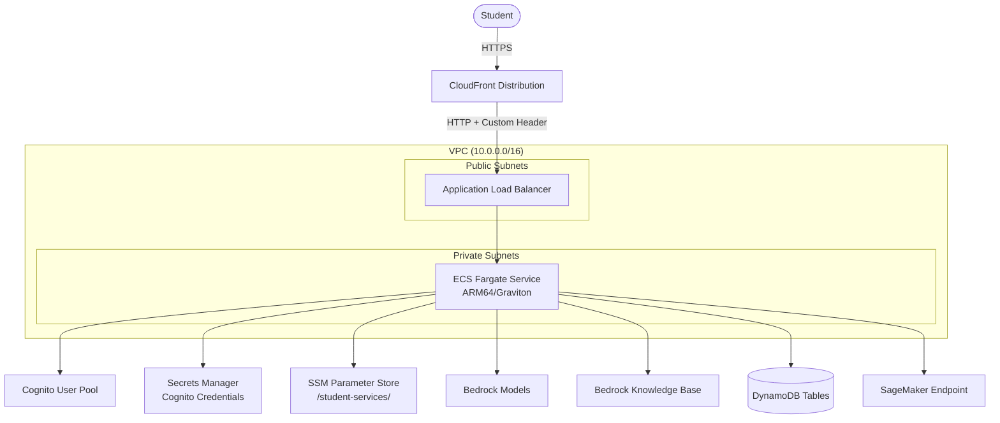

# Design Document: Workshop 4 Phase 2 — ECS Fargate Deployment

## Overview

Phase 2 takes the Phase 1 monolithic Streamlit app and deploys it as a web application on ECS Fargate (ARM64/Graviton), secured behind CloudFront with Cognito user authentication. The CDK stack and Docker build run on code-server (Graviton EC2), enabling native ARM builds without cross-compilation.

### Key Design Decisions

| Decision | Rationale |
|----------|-----------|
| ARM64/Graviton Fargate | ~20% cost savings vs x86, native build on code-server (also ARM) |
| CDK (not CloudFormation YAML) | Reference pattern uses CDK; CDK handles Docker build + ECR push automatically |
| CloudFront + ALB + custom header | Restricts ALB access to CloudFront only; provides HTTPS termination |
| Cognito for auth | Managed user pool (`StudentServicesPhase2UserPool`) for end-user login. Phase 3 creates its own (`StudentServicesPhase3UserPool`) + separate pools for agent-to-agent identity. No Phase 1 pool — Phase 1 has no authentication. |
| Reuse Phase 1 code as-is | Copy `workshop4/phase1/` source into Docker container; no code changes needed |
| SSM Parameter Store for config | Same config mechanism as Phase 1; no env var overrides needed in ECS |
| code-server for build/deploy | ARM-native Docker builds; CDK deploy from same environment |

## Architecture



## Directory Structure

```
workshop4/phase2/
├── cdk/
│   ├── __init__.py
│   └── cdk_stack.py              # CDK stack definition
├── docker_app/
│   ├── Dockerfile                # ARM64 Python 3.12 base
│   ├── requirements.txt          # Container dependencies
│   ├── config_file.py            # CDK/Cognito config (stack name, secrets ID, region)
│   ├── streamlit_app/            # Copied from phase1
│   │   ├── app.py
│   │   └── config.py
│   ├── shared/
│   │   ├── cross_platform_tools.py
│   │   └── model_factory.py
│   ├── course_review_agent/
│   │   └── agent.py
│   ├── course_registration_agent/
│   │   └── agent.py
│   ├── loan_application_agent/
│   │   └── agent.py
│   ├── math_teaching_agent/
│   │   └── agent.py
│   └── student_services_agent/
│       └── agent.py
├── app.py                        # CDK app entry point
├── cdk.json                      # CDK configuration
├── requirements.txt              # CDK dependencies (aws-cdk-lib)
├── deploy.sh                     # One-command deploy script
└── README.md
```

## Components

### Dockerfile (`docker_app/Dockerfile`)

```dockerfile
FROM --platform=linux/arm64 python:3.12
EXPOSE 8501
WORKDIR /app
COPY requirements.txt ./requirements.txt
RUN pip3 install --upgrade pip && pip3 install -r requirements.txt
COPY . .
ENV BYPASS_TOOL_CONSENT=true
ENV OTEL_SDK_DISABLED=true
CMD streamlit run streamlit_app/app.py --server.port 8501 --server.address 0.0.0.0
```

### CDK Stack (`cdk/cdk_stack.py`)

Key resources:
- **Cognito User Pool** + Client → credentials stored in Secrets Manager
- **VPC** (2 AZs, 1 NAT gateway, public + private subnets)
- **ECS Cluster** with Fargate capacity provider
- **Fargate Task Definition** (ARM64, 512 MiB, 256 CPU)
- **ECS Service** in private subnets
- **ALB** in public subnets, restricted to CloudFront via custom header
- **CloudFront Distribution** → ALB origin
- **IAM Policy** on task role: Bedrock, SageMaker, DynamoDB, SSM, Secrets Manager, S3 Vectors

### Config File (`docker_app/config_file.py`)

```python
class Config:
    STACK_NAME = "StudentServicesPhase2"
    CUSTOM_HEADER_VALUE = "student-services-cf-header-2026"
    SECRETS_MANAGER_ID = f"{STACK_NAME}CognitoSecret"
    DEPLOYMENT_REGION = "us-west-2"
```

### Deploy Script (`deploy.sh`)

```bash
#!/bin/bash
set -e
# Bootstrap CDK (first time only)
cdk bootstrap
# Deploy (builds Docker, pushes to ECR, deploys stack)
cdk deploy --require-approval never
```

### Authentication Integration

The Streamlit app uses `streamlit-cognito-auth` library to integrate with Cognito:
1. On startup, reads Cognito pool ID, client ID, and client secret from Secrets Manager
2. Presents login page to unauthenticated users
3. Grants access after successful authentication

### IAM Policy (Task Role)

```python
actions = [
    # Bedrock
    "bedrock:InvokeModel", "bedrock:InvokeModelWithResponseStream",
    "bedrock:Retrieve", "bedrock:RetrieveAndGenerate",
    # SageMaker
    "sagemaker:InvokeEndpoint",
    # DynamoDB
    "dynamodb:GetItem", "dynamodb:PutItem", "dynamodb:Query",
    "dynamodb:Scan", "dynamodb:BatchWriteItem",
    # SSM
    "ssm:GetParameter", "ssm:GetParameters", "ssm:GetParametersByPath",
    # S3 Vectors (for KB)
    "s3vectors:QueryVectors", "s3vectors:GetVector",
]
```

## Data Flow

1. User accesses CloudFront URL → redirected to Cognito login
2. After authentication, requests flow: CloudFront → ALB (custom header check) → ECS container
3. Container runs the same Streamlit app as Phase 1
4. App reads config from SSM, invokes Bedrock/SageMaker/DynamoDB as needed
5. Responses flow back through the same path

## Deployment Flow (on code-server)

1. Developer SSHs into code-server (or uses web UI)
2. `cd workshop4/phase2 && ./deploy.sh`
3. CDK builds Docker image natively on ARM (no cross-compilation needed)
4. CDK pushes image to ECR
5. CDK creates/updates CloudFormation stack
6. ECS pulls new image and starts container
7. CloudFront URL is output — developer creates Cognito user and accesses app
