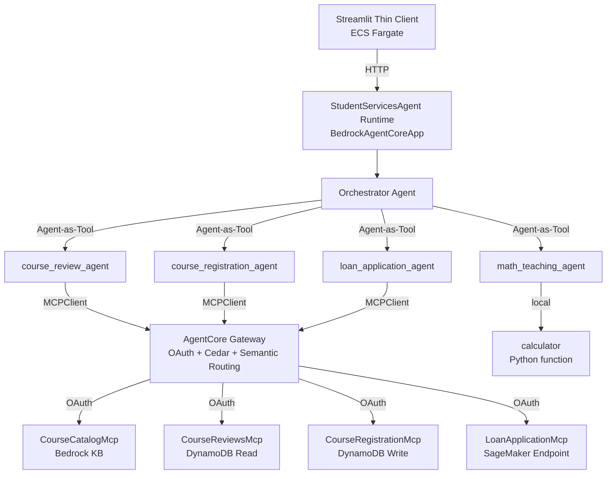

# Design Document: Workshop 4 Phase 3 Agent Swarm Refactoring

## Overview

This design refactors Workshop 4 Phase 3 from the broken "Agent-inside-MCP" anti-pattern to the AWS-recommended architecture: all agent intelligence consolidated in one AgentCore HTTP Runtime using the Agent-as-Tool pattern locally, with only dumb deterministic data-access tools exposed as MCP servers via AgentCore Gateway.

The key architectural insight: **reasoning stays centralized, data access is distributed**. The orchestrator and specialist agents run in a single process (same as Phase 2's Agent-as-Tool pattern), while their data-access tools are decoupled behind the AgentCore Gateway for independent scaling, OAuth per-service, Cedar policies, and per-tool observability.

### High-Level Architecture



### Request Flow

```
User Query → Streamlit → HTTP POST → StudentServicesAgent Runtime
  → Orchestrator (Bedrock call #1: routing decision)
    → Specialist Agent (Bedrock call #2: domain reasoning)
      → MCPClient → Gateway → Dumb MCP Server → AWS Service
      ← Data result
    ← Specialist response with routing_path
  ← Final response to user
```

Maximum 2 Bedrock LLM calls per request (orchestrator + specialist), down from 3 in the broken architecture.

## Architecture

### Layer Separation

| Layer | Component | Responsibility |
|-------|-----------|---------------|
| **Presentation** | Streamlit thin client | UI, session management, HTTP calls to runtime |
| **Reasoning** | StudentServicesAgent Runtime | All agent intelligence — orchestrator + 4 specialists |
| **Transport** | AgentCore Gateway | OAuth, Cedar policies, semantic routing, observability |
| **Data Access** | 4 Dumb MCP Servers | Deterministic AWS SDK calls only |

### Runtime Topology (agentcore.json)

| Runtime | Protocol | Purpose |
|---------|----------|---------|
| `StudentServicesAgent` | HTTP | Orchestrator + specialist agents |
| `CourseCatalogMcp` | MCP | Bedrock KB retrieve |
| `CourseReviewsMcp` | MCP | DynamoDB read |
| `CourseRegistrationMcp` | MCP | DynamoDB write |
| `LoanApplicationMcp` | MCP | SageMaker invoke |

**Removed:** `MathTeachingMcp` (pure computation, no external data access needed)

### Gateway Targets

| Target Name | MCP Server | Tool(s) |
|-------------|-----------|---------|
| `coursecatalog` | CourseCatalogMcp | `search_course_catalog` |
| `coursereviews` | CourseReviewsMcp | `get_course_reviews` |
| `courseregistration` | CourseRegistrationMcp | `register_course` |
| `loanapplication` | LoanApplicationMcp | `predict_loan` |

## Components and Interfaces

### 0. CloudFormation Infrastructure (`cloudformation/student-services-agentcore-infra.yaml`)

The CloudFormation template provides foundational infrastructure (IAM roles + Cognito pools) that AgentCore references during deployment. It must be updated and deployed BEFORE any AgentCore CLI operations.

**Changes from current template:**
- **REMOVE**: MathTeaching domain (execution role, Cognito pool, domain, resource server, app client, outputs)
- **REPLACE**: CourseReview domain → split into CourseCatalog + CourseReviews domains
- **KEEP**: StudentServicesAgent, StudentServicesGateway, CourseRegistration, LoanApplication domains unchanged

**New domains:**

| Domain | Execution Role Permissions | Cognito Scope |
|--------|---------------------------|---------------|
| CourseCatalog | Base + `bedrock:Retrieve` on KB resources | `course-catalog/access` |
| CourseReviews | Base + `AmazonDynamoDBReadOnlyAccess` | `course-reviews/access` |

### 1. Orchestrator Runtime (`student_services/agent.py`)

The orchestrator runtime follows the travelplanner reference pattern with one key extension: instead of giving the MCPClient directly to a single agent, it creates specialist agents as tools, each with their own system prompt and the shared MCPClient.

```python
# Pseudocode structure
app = BedrockAgentCoreApp()

@app.entrypoint
def invoke(payload, context):
    mcp_client = get_mcp_client()  # Single MCPClient → Gateway
    
    # Specialist agents defined as @tool functions
    # Each gets the mcp_client tools + its own system prompt
    orchestrator = Agent(
        model=model,
        system_prompt=ORCHESTRATOR_PROMPT,
        tools=[course_review_agent, course_registration_agent, 
               loan_application_agent, math_teaching_agent],
    )
    return {"response": str(orchestrator(prompt))}
```

**Key design decision:** Each specialist agent is a `@tool`-decorated function that internally creates a Strands Agent with the shared MCPClient. The orchestrator sees them as simple tools and routes based on its system prompt.

#### Specialist Agent Pattern

```python
@tool
def course_review_agent(query: str) -> str:
    """Handle course catalog and review queries."""
    agent = Agent(
        model=model,
        system_prompt=COURSE_REVIEW_PROMPT,
        tools=[mcp_client],  # All gateway tools available
    )
    response = agent(query)
    return json.dumps({
        "response": str(response),
        "routing_path": "StudentServicesAgent → course_review_agent → Gateway → CourseCatalogMcp + CourseReviewsMcp"
    })
```

#### Math Teaching Agent (Local Only)

```python
@tool
def math_teaching_agent(query: str) -> str:
    """Solve math problems with step-by-step explanations."""
    agent = Agent(
        model=model,
        system_prompt=MATH_PROMPT,
        tools=[calculator],  # Local function, no MCP
    )
    response = agent(query)
    return json.dumps({
        "response": str(response),
        "routing_path": "StudentServicesAgent → math_teaching_agent → calculator (local)"
    })
```

### 2. CourseCatalogMcp (`course_catalog/server.py`)

```python
from fastmcp import FastMCP
import boto3, os

mcp = FastMCP("course-catalog-mcp-server")

KB_ID = os.environ.get("KNOWLEDGE_BASE_ID", "NCGF0S9LJR")
REGION = os.environ.get("AWS_REGION", "us-west-2")

@mcp.tool()
def search_course_catalog(query: str) -> dict:
    """Search the course catalog knowledge base."""
    client = boto3.client("bedrock-agent-runtime", region_name=REGION)
    response = client.retrieve(
        knowledgeBaseId=KB_ID,
        retrievalQuery={"text": query},
        retrievalConfiguration={"vectorSearchConfiguration": {"numberOfResults": 5}},
    )
    results = response.get("retrievalResults", [])
    # Format and return
    ...
```

### 3. CourseReviewsMcp (`course_reviews/server.py`)

```python
@mcp.tool()
def get_course_reviews(course_name: str) -> dict:
    """Get student reviews for a course from DynamoDB."""
    dynamodb = boto3.resource("dynamodb", region_name=REGION)
    table = dynamodb.Table(TABLE_NAME)
    # Scan with contains filter for partial matching
    response = table.scan(
        FilterExpression="contains(course_name, :cn)",
        ExpressionAttributeValues={":cn": course_name},
    )
    ...
```

### 4. CourseRegistrationMcp (`course_registration/server.py`)

```python
@mcp.tool()
def register_course(student_id: str, course_name: str, semester: str) -> dict:
    """Register a student in a course."""
    # Validate all required params
    missing = [f for f, v in [("student_id", student_id), ...] if not v or not v.strip()]
    if missing:
        return {"error": f"Missing required fields: {', '.join(missing)}"}
    # Write to DynamoDB with UUID
    ...
```

### 5. LoanApplicationMcp (`loan_application/server.py`)

```python
@mcp.tool()
def predict_loan(features_csv: str) -> dict:
    """Predict loan acceptance from 59 CSV features."""
    values = [v.strip() for v in features_csv.split(",") if v.strip()]
    if len(values) != 59:
        return {"error": f"Expected 59 features, got {len(values)}"}
    # Invoke SageMaker endpoint
    ...
```

### 6. Calculator (Local Function)

```python
import math

ALLOWED_NAMES = {
    "abs": abs, "max": max, "min": min, "pow": pow, "round": round, "sum": sum,
    **{k: getattr(math, k) for k in dir(math) if not k.startswith("_")},
}

@tool
def calculator(expression: str) -> str:
    """Evaluate a mathematical expression safely."""
    try:
        result = eval(expression, {"__builtins__": {}}, ALLOWED_NAMES)
        return str(result)
    except Exception as e:
        return f"Error: {e}"
```

## Data Models

### Request/Response Flow

```
# Incoming (from Streamlit thin client)
POST /invoke
{
    "prompt": "What are the most challenging courses?"
}

# Internal routing (orchestrator → specialist)
course_review_agent(query="What are the most challenging courses?")

# MCP tool call (specialist → gateway → MCP server)
search_course_catalog(query="challenging courses difficulty")
get_course_reviews(course_name="CS 441")

# Response (back to client)
{
    "response": "Based on the catalog and student reviews...\n\n🔀 Routing: StudentServicesAgent → course_review_agent → Gateway → CourseCatalogMcp + CourseReviewsMcp"
}
```

### agentcore.json Structure (Key Changes)

**Runtimes:** 5 total (1 HTTP + 4 MCP)
- `StudentServicesAgent` — HTTP, unchanged
- `CourseCatalogMcp` — NEW, replaces part of CourseReviewMcp
- `CourseReviewsMcp` — NEW, replaces part of CourseReviewMcp
- `CourseRegistrationMcp` — SIMPLIFIED (remove inner agent)
- `LoanApplicationMcp` — SIMPLIFIED (remove inner agent)
- ~~`MathTeachingMcp`~~ — REMOVED

**Gateway targets:** 4 (was 4, but different tools)
- `coursecatalog` → `search_course_catalog`
- `coursereviews` → `get_course_reviews`
- `courseregistration` → `register_course`
- `loanapplication` → `predict_loan`

**Credentials:** Remove `MathTeachingMcp-oauth`, add `CourseCatalogMcp-oauth` and `CourseReviewsMcp-oauth` (reusing existing CourseReview Cognito pool or creating new ones as needed).

### Directory Structure (After Refactoring)

```
workshop4/phase3/studentservices/
├── student_services/
│   └── agent.py              # Orchestrator + specialist agents (Agent-as-Tool)
├── course_catalog/
│   ├── server.py             # Dumb MCP: search_course_catalog
│   └── requirements.txt      # fastmcp, boto3
├── course_reviews/
│   ├── server.py             # Dumb MCP: get_course_reviews
│   └── requirements.txt      # fastmcp, boto3
├── course_registration/
│   ├── server.py             # Dumb MCP: register_course
│   └── requirements.txt      # fastmcp, boto3
├── loan_application/
│   ├── server.py             # Dumb MCP: predict_loan
│   └── requirements.txt      # fastmcp, boto3
├── policies/
│   └── *.cedar               # Cedar policies (preserved)
├── agentcore/
│   ├── agentcore.json        # Updated topology
│   └── ...
└── README.md                 # Updated with architecture explanation
```

**Removed directories:** `math_teaching/`, `course_review/` (split into `course_catalog/` + `course_reviews/`)

## Correctness Properties

*A property is a characteristic or behavior that should hold true across all valid executions of a system — essentially, a formal statement about what the system should do. Properties serve as the bridge between human-readable specifications and machine-verifiable correctness guarantees.*

### Property 1: OAuth Token Cache Refresh Timing

*For any* OAuth token with expiry time T seconds from now, the token cache SHALL return the cached token when current time < (issue_time + T - 300), and SHALL fetch a new token when current time >= (issue_time + T - 300).

**Validates: Requirements 2.5**

### Property 2: Registration Parameter Validation Completeness

*For any* combination of the three parameters (student_id, course_name, semester) where one or more are missing or consist entirely of whitespace, the `register_course` function SHALL return an error message that lists exactly those fields that are missing or empty.

**Validates: Requirements 5.3**

### Property 3: Loan Feature Count Validation

*For any* CSV string containing N comma-separated values where N ≠ 59, the `predict_loan` function SHALL return an error message containing the actual count N.

**Validates: Requirements 6.3**

### Property 4: Error Message ARN and Account ID Redaction

*For any* error message string containing AWS ARN patterns (matching `arn:aws[:\w\-/]*`) or 12-digit numeric sequences, the sanitization function SHALL replace all ARN patterns with `[REDACTED_ARN]` and all 12-digit sequences with `[REDACTED_ACCOUNT]`, and the output SHALL contain no remaining ARN patterns or 12-digit sequences.

**Validates: Requirements 6.6**

### Property 5: Calculator Safe Evaluation

*For any* mathematical expression composed only of numeric literals, arithmetic operators (+, -, *, /, **), parentheses, and allowed function names (abs, max, min, pow, round, sum, math.*), the calculator SHALL return a numeric result. *For any* expression containing names not in the allowed set (e.g., os, sys, exec, eval, open, import), the calculator SHALL return an error without executing the expression.

**Validates: Requirements 7.2**

## Error Handling

### Orchestrator Level

| Error Condition | Handling |
|----------------|----------|
| Empty/missing prompt | Return `{"response": "Error: 'prompt' field is required and cannot be empty."}` |
| MCPClient connection failure | Specialist agent returns error string; orchestrator passes through |
| OAuth token fetch failure | Raise RuntimeError with status code (no secrets in message) |
| Specialist agent timeout | Strands SDK handles timeout; error propagates as tool result |

### MCP Server Level

| Error Condition | Handling |
|----------------|----------|
| Missing required parameters | Return `{"error": "Missing required fields: ..."}` |
| AWS SDK call failure | Return `{"error": "..."}` with sanitized message (no ARNs/account IDs) |
| Invalid input format | Return `{"error": "Expected X, got Y"}` with specific details |
| DynamoDB no results | Return empty results structure (not an error) |

### Gateway Level

| Error Condition | Handling |
|----------------|----------|
| Invalid OAuth token | Gateway returns 401; MCPClient propagates error |
| Cedar policy deny | Gateway returns 403; MCPClient propagates error |
| MCP server unreachable | Gateway returns 502; MCPClient propagates error |

## Testing Strategy

### Unit Tests (Example-Based)

Focus on specific scenarios and integration points:

1. **Orchestrator routing** — verify correct specialist is called for each domain
2. **MCP server tool interfaces** — verify correct parameters and return types
3. **Gateway configuration** — verify agentcore.json has correct topology
4. **Routing path generation** — verify correct format for each specialist

### Property-Based Tests

Using `hypothesis` (Python PBT library), minimum 100 iterations per property:

1. **OAuth token cache timing** — generate random expiry times, verify refresh logic
   - Tag: `Feature: workshop4-phase3-agent-swarm-refactoring, Property 1: OAuth token cache refresh timing`

2. **Registration parameter validation** — generate all combinations of missing/empty params
   - Tag: `Feature: workshop4-phase3-agent-swarm-refactoring, Property 2: Registration parameter validation completeness`

3. **Loan CSV count validation** — generate CSV strings with various counts ≠ 59
   - Tag: `Feature: workshop4-phase3-agent-swarm-refactoring, Property 3: Loan feature count validation`

4. **Error message redaction** — generate strings with embedded ARNs and account IDs
   - Tag: `Feature: workshop4-phase3-agent-swarm-refactoring, Property 4: Error message ARN and account ID redaction`

5. **Calculator safety** — generate valid math expressions and malicious expressions
   - Tag: `Feature: workshop4-phase3-agent-swarm-refactoring, Property 5: Calculator safe evaluation`

### Integration Tests

1. **End-to-end with mocked AWS services** — verify full flow from prompt to response
2. **Gateway connectivity** — verify OAuth token acquisition and MCP tool invocation
3. **DynamoDB operations** — verify read/write with local DynamoDB or mocks
4. **SageMaker invocation** — verify endpoint call with mocked response

### Smoke Tests

1. **agentcore.json validity** — verify 5 runtimes, correct protocols, no MathTeachingMcp
2. **No agent imports in MCP servers** — verify no strands/BedrockModel in dumb servers
3. **MCP_TRANSPORT handling** — verify each server responds to env var
4. **FastMCP floating version** — verify no version pin in requirements.txt
