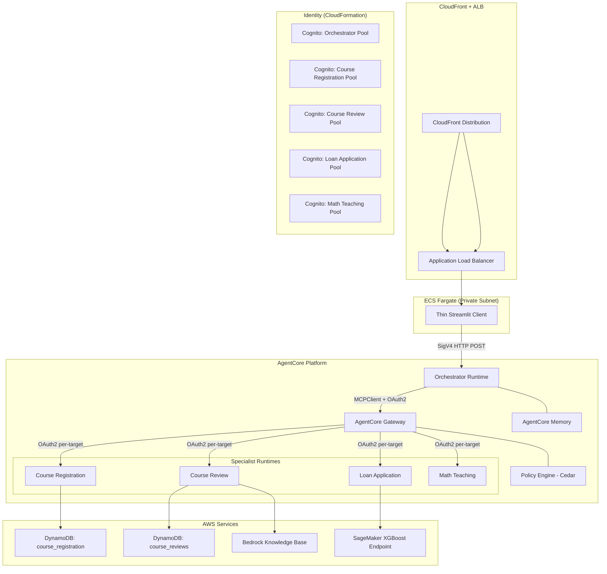

# Design Document: Phase 3 — AgentCore Microservices Decomposition

## Overview

Phase 3 decomposes the monolithic Student Services application into five independent AgentCore Runtimes communicating through a single AgentCore Gateway. The architecture follows the TravelPlanner reference pattern: each specialist agent becomes a standalone runtime with its own Cognito identity, the orchestrator connects to specialists via an MCP Gateway (agents-as-tools), and a thin Streamlit client on ECS Fargate invokes the orchestrator via SigV4-signed HTTP.

Key design decisions:
- **Flat resource model** in `agentcore.json` — all runtimes, credentials, gateway, memory, and policies declared in one file
- **Per-runtime Cognito pools** — isolated OAuth2 identity for each runtime, enabling independent rotation and access control
- **Gateway aggregation** — orchestrator sees all specialist tools through one MCP endpoint instead of managing four connections
- **Cedar policies** — content safety enforcement at the Gateway layer before requests reach specialists
- **Thin client decoupling** — frontend knows only the orchestrator URL; backend changes require zero client redeployment

## Architecture



### Request Flow

1. User submits message in Streamlit UI
2. Thin Client sends SigV4-signed HTTP POST to Orchestrator Runtime URL
3. Orchestrator extracts prompt, retrieves memory context, invokes Strands Agent
4. Agent routes to specialist via Gateway tool call (MCPClient streamable-http)
5. Gateway authenticates outbound request with per-target OAuth2 credential
6. Policy Engine evaluates Cedar policies before forwarding
7. Specialist Runtime processes request, returns result
8. Response flows back: Specialist → Gateway → Orchestrator → Thin Client

## Components and Interfaces

### 1. Identity Stack (CloudFormation)

**File:** `workshop4/phase3/cloudformation/student-services-identity.yaml`

Creates five Cognito User Pools with identical structure:

| Runtime | Pool Domain Pattern | Resource Server ID | Scope |
|---------|--------------------|--------------------|-------|
| Orchestrator | `orchestrator-{AccountId}` | `orchestrator` | `orchestrator/access` |
| Course Registration | `course-registration-{AccountId}` | `course-registration` | `course-registration/access` |
| Course Review | `course-review-{AccountId}` | `course-review` | `course-review/access` |
| Loan Application | `loan-application-{AccountId}` | `loan-application` | `loan-application/access` |
| Math Teaching | `math-teaching-{AccountId}` | `math-teaching` | `math-teaching/access` |

Each pool exports: User Pool ID, Discovery URL, App Client ID, Token Endpoint, OAuth Scope.

### 2. AgentCore Project Configuration

**File:** `workshop4/phase3/studentservices/agentcore/agentcore.json`

Flat resource model following the TravelPlanner pattern:

```json
{
  "$schema": "https://schema.agentcore.aws.dev/v1/agentcore.json",
  "name": "studentservices",
  "version": 1,
  "runtimes": [ /* 5 runtimes */ ],
  "memories": [ /* 1 memory */ ],
  "credentials": [ /* 5 OAuth providers */ ],
  "agentCoreGateways": [ /* 1 gateway with 4 targets */ ],
  "policyEngines": [ /* 1 engine with Cedar policies */ ]
}
```

**Project constraints:**
- No separate Git repository — the AgentCore project lives within the existing workspace repo under `workshop4/phase3/studentservices/`
- Uses CodeZip build type (direct code deployment, no Docker) for all runtimes
- The thin Streamlit client is a separate CDK project under `workshop4/phase3/deploy-streamlit-app/` requiring Docker build (deployed from code-server)
- Local dev thin client at `workshop4/phase3/streamlit_app/`

### 3. Orchestrator Runtime

**File:** `workshop4/phase3/studentservices/student_services/agent.py`

```python
# Entrypoint pattern
app = BedrockAgentCoreApp()

@app.entrypoint
def invoke(payload: dict, context: dict | None = None) -> dict:
    prompt = payload.get("prompt")
    if not prompt:
        return {"response": "Error: 'prompt' field is required"}
    # Build/retrieve cached agent with MCPClient → Gateway
    # Integrate AgentCore Memory via session manager
    response = agent(prompt)
    return {"response": str(response)}
```

**Key behaviors:**
- OAuth2 token caching with 300s pre-expiry refresh (same as TravelPlanner)
- MCPClient with `streamablehttp_client` transport and custom `_OAuthAuth` class
- Agent caching keyed by `{session_id}/{user_id}`
- Memory integration conditional on `MEMORY_*_ID` env var presence

### 4. Course Registration Specialist Runtime

**File:** `workshop4/phase3/studentservices/course_registration/agent.py`

**Interface:**
- Input: `{"prompt": "Register STU001 for CS 441 in Fall 2026"}`
- Output: `{"response": "Registration successful! ID: uuid..."}`

**Validation logic (pure function):**
```python
def validate_registration(student_id, course_name, semester) -> list[str]:
    """Returns list of missing/empty field names."""
```

### 5. Course Review Specialist Runtime

**File:** `workshop4/phase3/studentservices/course_review/agent.py`

**Interface:**
- Input: `{"prompt": "What are the reviews for CS 441?"}`
- Output: `{"response": "..."}`

**External dependencies:** Bedrock KB (NCGF0S9LJR), DynamoDB (course_reviews)

### 6. Loan Application Specialist Runtime

**File:** `workshop4/phase3/studentservices/loan_application/agent.py`

**Interface:**
- Input: `{"prompt": "Predict loan for: 29,2,999,..."}`
- Output: `{"response": "Score: 0.82, Label: Accept, Confidence: 82.0%"}`

**Pure functions:**
- `validate_csv_features(payload: str) -> tuple[bool, int]` — checks exactly 59 values
- `interpret_prediction(score: float) -> dict` — maps score to label/confidence
- `sanitize_error(msg: str) -> str` — redacts ARNs, account IDs, endpoint names

### 7. Math Teaching Specialist Runtime

**File:** `workshop4/phase3/studentservices/math_teaching/agent.py`

**Interface:**
- Input: `{"prompt": "Solve 3x + 7 = 22"}`
- Output: `{"response": "Step 1: Subtract 7..."}`

### 8. AgentCore Gateway

Declared in `agentcore.json`. Single endpoint aggregating four specialist targets with:
- CUSTOM_JWT inbound auth (Orchestrator pool)
- OAuth2 outbound auth per target
- Semantic search enabled
- Policy Engine in ENFORCE mode

### 9. Thin Streamlit Client

**File:** `workshop4/phase3/deploy-streamlit-app/docker_app/`

- `agent_client.py` — SigV4-signed HTTP POST to `STUDENT_SERVICES_AGENT_URL`
- `app.py` — Streamlit chat UI with Cognito auth
- `Dockerfile` — ARM64 container image

### 10. CDK Stack

**File:** `workshop4/phase3/deploy-streamlit-app/cdk/cdk_stack.py`

Provisions: VPC (2 AZs), ECS Fargate (ARM64, private subnets), ALB (custom header routing), CloudFront (HTTPS redirect, no cache), Cognito User Pool + Secrets Manager, IAM policies.

## Data Models

### Registration Record (DynamoDB)

```json
{
  "reg_id": "uuid-v4",
  "student_id": "STU001",
  "course_name": "CS 441 Machine Learning",
  "semester": "Fall 2026"
}
```

### AgentCore Invocation Payload

```json
// Request
{"prompt": "user message text"}

// Response
{"response": "agent response text"}
```

### OAuth2 Token Cache

```python
_token_cache = {
    "token": "eyJ...",           # JWT access token
    "expires_at": 1720000000.0   # Unix timestamp (actual expiry - 300s)
}
```

### Memory Namespace Schema

| Strategy | Namespace Pattern | Purpose |
|----------|------------------|---------|
| SEMANTIC | `/users/{actorId}/facts` | Stored semantic facts about user |
| SUMMARIZATION | `/summaries/{actorId}/{sessionId}` | Conversation summaries |
| USER_PREFERENCE | `/users/{actorId}/preferences` | Extracted user preferences |

### Cedar Policy Schema

```cedar
// Baseline permit
permit (principal, action, resource == AgentCore::Gateway::"<gateway-arn>");

// Content safety deny
forbid (principal, action, resource == AgentCore::Gateway::"<gateway-arn>")
when { context.input.containsAbusiveLanguage };
```


## Correctness Properties

*A property is a characteristic or behavior that should hold true across all valid executions of a system — essentially, a formal statement about what the system should do. Properties serve as the bridge between human-readable specifications and machine-verifiable correctness guarantees.*

### Property 1: Missing or empty prompt returns error

*For any* invocation payload that either lacks a "prompt" key or has a "prompt" value that is empty or consists entirely of whitespace, the Orchestrator Runtime SHALL return a JSON object with a "response" field containing an error message, and SHALL NOT invoke the downstream agent.

**Validates: Requirements 3.3**

### Property 2: OAuth token cache respects 300-second pre-expiry refresh

*For any* cached token with an `expires_at` timestamp, if the current time is less than `expires_at` (which is already set to actual_expiry - 300s), the cached token SHALL be returned without a network call. If the current time is greater than or equal to `expires_at`, a new token SHALL be fetched.

**Validates: Requirements 3.5**

### Property 3: Registration field validation identifies all invalid fields

*For any* combination of (student_id, course_name, semester) values where one or more fields are None, empty string, or whitespace-only, the validation function SHALL return exactly the set of field names that are invalid, and no record SHALL be written.

**Validates: Requirements 4.2, 4.4**

### Property 4: Error sanitization redacts all sensitive patterns

*For any* error message string containing AWS ARNs (matching `arn:aws...`), 12-digit account IDs, or endpoint resource names (matching `endpoint/...`), the sanitization function SHALL produce an output string that contains none of these patterns while preserving the non-sensitive portions of the message.

**Validates: Requirements 4.5, 6.4**

### Property 5: CSV feature count validation accepts exactly 59 values

*For any* comma-separated string, the validation function SHALL return `(True, 59)` if and only if splitting by comma produces exactly 59 non-empty tokens. For all other counts, it SHALL return `(False, actual_count)` where `actual_count` equals the number of comma-separated tokens.

**Validates: Requirements 6.2, 6.6**

### Property 6: Prediction score interpretation is consistent

*For any* float score in [0.0, 1.0], `interpret_prediction` SHALL return label "Accept" with confidence `round(score * 100, 1)` when score >= 0.5, and label "Reject" with confidence `round((1 - score) * 100, 1)` when score < 0.5. The confidence SHALL always be in the range [50.0, 100.0].

**Validates: Requirements 6.3**

## Error Handling

### Orchestrator Runtime
| Error Condition | Behavior |
|----------------|----------|
| Missing/empty prompt | Return `{"response": "Error: 'prompt' field is required"}` |
| OAuth token fetch failure | Raise RuntimeError with status code (no secrets in message) |
| Gateway unreachable | Agent returns error through Strands exception handling |
| Memory service unavailable | Operate without memory; do not terminate session |

### Course Registration Runtime
| Error Condition | Behavior |
|----------------|----------|
| Missing/empty fields | Return error listing each invalid field name |
| DynamoDB write failure | Return generic "database error" message; redact table names/ARNs |

### Course Review Runtime
| Error Condition | Behavior |
|----------------|----------|
| Bedrock KB unreachable/empty | Return "no matching course catalog information found" |
| DynamoDB unreachable/empty | Return "no reviews available for the requested course" |

### Loan Application Runtime
| Error Condition | Behavior |
|----------------|----------|
| Feature count ≠ 59 | Return error with expected (59) and actual count |
| SageMaker invocation failure | Return sanitized error (ARNs, account IDs, endpoint names redacted) |

### Math Teaching Runtime
| Error Condition | Behavior |
|----------------|----------|
| Non-math or unsolvable input | Return error suggesting user rephrase as specific math question |

### Thin Client
| Error Condition | Behavior |
|----------------|----------|
| STUDENT_SERVICES_AGENT_URL missing | Fail to start; log error message |
| Orchestrator timeout (>60s) | Display error; preserve conversation history |
| Orchestrator HTTP error | Display error; preserve conversation history |

### Gateway / Policy Engine
| Error Condition | Behavior |
|----------------|----------|
| Invalid/expired/missing JWT | Reject with authentication error |
| Cedar policy violation | Deny request; return violation category without original input |
| Target runtime unreachable | Return error for that target; other targets unaffected |

## Testing Strategy

### Unit Tests (Example-Based)

Unit tests cover specific scenarios, integration points, and error conditions:

1. **Orchestrator entrypoint** — verify BedrockAgentCoreApp decorator, prompt extraction, response wrapping
2. **Memory conditional** — verify agent operates without memory when env var unset
3. **Registration success path** — verify response contains reg_id, student_id, course_name, semester
4. **Course Review fallback** — verify partial-match scan when exact match fails
5. **Thin Client startup** — verify failure when STUDENT_SERVICES_AGENT_URL is missing
6. **SigV4 request construction** — verify JSON body structure and auth headers

### Property-Based Tests (Universal Properties)

Property tests verify universal correctness across generated inputs. Use **Hypothesis** (Python PBT library) with minimum 100 iterations per property.

| Property | Test Target | Generator Strategy |
|----------|-------------|-------------------|
| Property 1: Missing prompt | `invoke()` function | Random dicts without "prompt" key, or with empty/whitespace values |
| Property 2: Token cache | `get_oauth_token()` logic | Random (current_time, expires_at) pairs |
| Property 3: Registration validation | `validate_registration()` | Random (str|None|whitespace) tuples for 3 fields |
| Property 4: Error sanitization | `sanitize_error()` | Random strings with injected ARN/account-ID/endpoint patterns |
| Property 5: CSV validation | `validate_csv_features()` | Random comma-separated strings of varying lengths |
| Property 6: Score interpretation | `interpret_prediction()` | Random floats in [0.0, 1.0] |

Each property test tagged with: `# Feature: workshop4-phase3-agentcore-microservices, Property {N}: {title}`

### Integration Tests

Integration tests verify external service interactions with 1-3 representative examples:

1. **Gateway connectivity** — MCPClient connects and lists tools
2. **DynamoDB write** — registration record persists correctly
3. **Bedrock KB retrieval** — returns results for known course query
4. **SageMaker invocation** — returns prediction score for valid 59-feature payload
5. **Cognito token exchange** — client_credentials flow returns valid JWT
6. **SigV4 end-to-end** — thin client successfully invokes orchestrator

### Infrastructure Tests (CDK Assertions)

CDK assertion tests validate synthesized CloudFormation template:

1. VPC with 2 AZs, public + private subnets
2. ECS Fargate service in private subnets (ARM64)
3. ALB with custom header condition and 403 default
4. CloudFront with HTTPS redirect, caching disabled
5. IAM policy with `bedrock-agentcore:InvokeAgentRuntime`
6. Secrets Manager secret with Cognito parameters
7. Container environment variable `STUDENT_SERVICES_AGENT_URL`

### CloudFormation Template Validation

Validate the identity stack template:

1. Five Cognito User Pools declared
2. Five User Pool Domains with correct naming pattern
3. Five Resource Servers with correct identifiers and scopes
4. Five App Clients with `client_credentials` grant
5. All required Stack Outputs present with correct format
